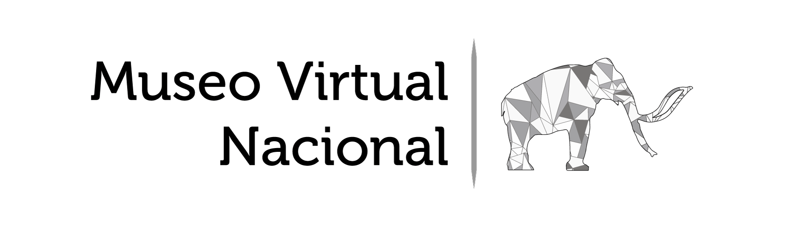
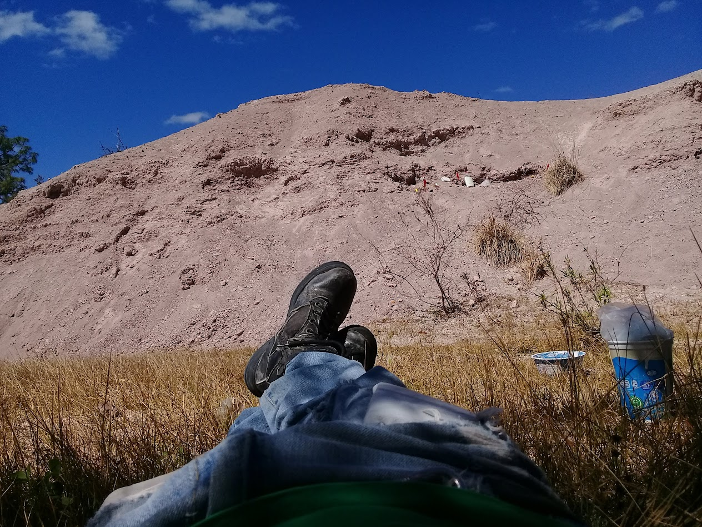
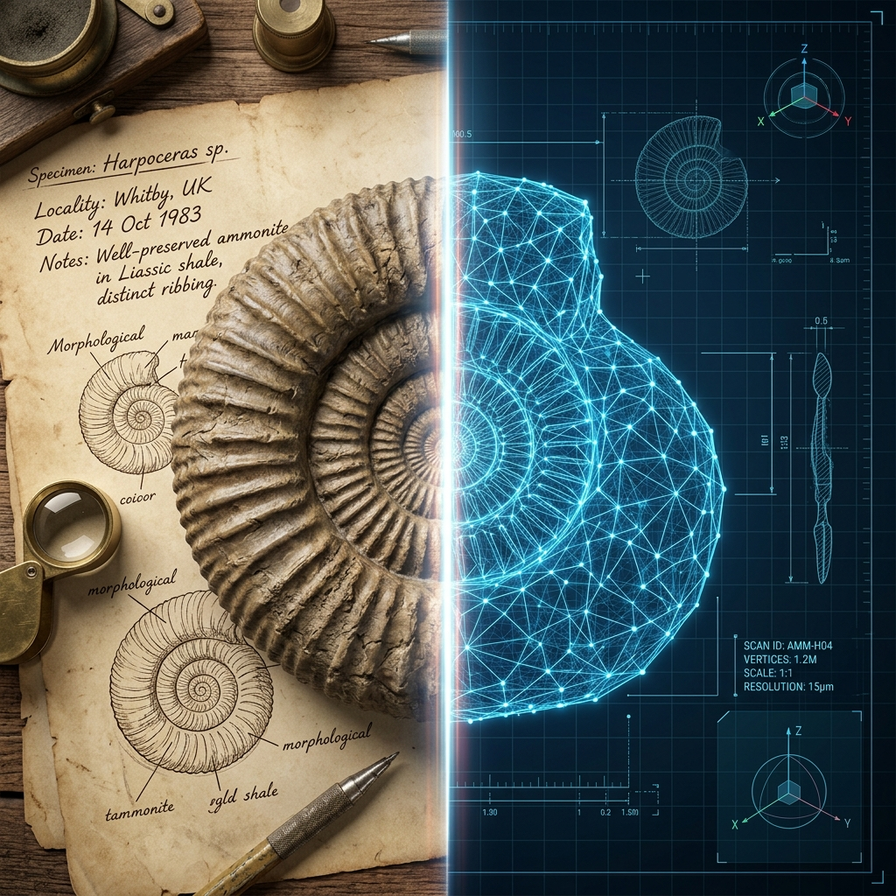

```{=html}
<!-- Hero Section -->
<div style="
  background: linear-gradient(135deg, #1E2B3A 0%, #2A3F5F 50%, #1a4a5c 100%);
  color: white;
  padding: 80px 40px 70px;
  text-align: center;
  margin-bottom: 0;
">
  
  <h1 style="font-size: 2.6rem; font-weight: 700; margin-bottom: 16px; letter-spacing: -0.5px;">
    Presentaciones del Museo Virtual Nacional
  </h1>
  <p style="font-size: 1.15rem; opacity: 0.85; max-width: 680px; margin: 0 auto 36px; line-height: 1.7;">
    Conferencias, talleres y recursos educativos sobre paleontología virtual
    y técnicas digitales aplicadas al estudio de la vida en el pasado.
  </p>
  <div style="display: flex; justify-content: center; gap: 14px; flex-wrap: wrap;">
    <a
      href="#charlas"
      style="background: #2A7D8C; color: white; padding: 12px 28px;
             border-radius: 25px; text-decoration: none; font-weight: 600;
             font-size: 0.95rem;"
    >Ver presentaciones</a>
    <a
      href="mailto:migueldlm1307@gmail.com"
      style="background: transparent; color: white; padding: 12px 28px;
             border-radius: 25px; text-decoration: none; font-weight: 600;
             border: 2px solid rgba(255,255,255,0.5); font-size: 0.95rem;"
    >Contacto</a>
  </div>
</div>

<!-- Wave divider -->
<div style="background: #1a4a5c; line-height: 0;">
  <svg viewBox="0 0 1440 60" xmlns="http://www.w3.org/2000/svg" preserveAspectRatio="none"
       style="display:block; width:100%; height:60px;">
    <path d="M0,30 C360,60 1080,0 1440,30 L1440,60 L0,60 Z" fill="#f0f2f5"/>
  </svg>
</div>

<!-- Main content -->
<div style="background: #f0f2f5; padding: 70px 20px 90px;">
<div style="max-width: 1100px; margin: 0 auto;">


  <!-- ═══════════════════════════════════════════
       SECCIÓN: Charlas y Conferencias
  ════════════════════════════════════════════ -->
  <div id="charlas" style="margin-bottom: 70px;">

    <div style="display: flex; align-items: center; gap: 14px; margin-bottom: 32px;">
      <div style="background: #1E2B3A; width: 5px; height: 38px; border-radius: 3px; flex-shrink: 0;"></div>
      <div>
        <h2 style="color: #1E2B3A; font-weight: 700; font-size: 1.6rem; margin: 0 0 3px;">
          Charlas y Conferencias
        </h2>
        <p style="color: #666; font-size: 0.88rem; margin: 0;">
          Presentaciones de divulgación sobre paleontología y técnicas virtuales
        </p>
      </div>
    </div>

    <div class="row g-4">

      <!-- Card: Paleontólogos sin Fósiles -->
      <div class="col-md-6">
        <div class="card h-100" style="border: none; border-radius: 14px;
             box-shadow: 0 4px 22px rgba(0,0,0,0.09); overflow: hidden;">
          <div style="position: relative; overflow: hidden; height: 210px;">
            
            <div style="position: absolute; inset: 0;
                        background: linear-gradient(to bottom, transparent 35%, rgba(30,43,58,0.8));"></div>
            <span style="position: absolute; top: 14px; left: 14px; background: #1E2B3A;
                         color: white; padding: 4px 13px; border-radius: 20px;
                         font-size: 0.72rem; font-weight: 700; letter-spacing: .6px;">
              CONFERENCIA
            </span>
          </div>
          <div class="card-body" style="padding: 24px 26px 12px;">
            <h5 style="color: #1E2B3A; font-weight: 700; font-size: 1.05rem; margin-bottom: 10px;">
              Paleontólogos sin Fósiles
            </h5>
            <p style="color: #555; font-size: 0.87rem; line-height: 1.65; margin: 0;">
              Técnicas de Paleontología Virtual: herramientas digitales para el estudio
              de la vida en el pasado sin necesidad de acceder físicamente a los fósiles.
            </p>
          </div>
          <div class="card-footer" style="background: transparent; border: none; padding: 12px 26px 24px;">
            <a href="paleo_sin_fosiles.qmd"
               style="display: inline-block; background: #1E2B3A; color: white;
                      padding: 8px 22px; border-radius: 20px; text-decoration: none;
                      font-size: 0.84rem; font-weight: 600;">
              Ver presentación →
            </a>
          </div>
        </div>
      </div>

      <!-- Card: Camino a la Paleontología -->
      <div class="col-md-6">
        <div class="card h-100" style="border: none; border-radius: 14px;
             box-shadow: 0 4px 22px rgba(0,0,0,0.09); overflow: hidden;">
          <div style="position: relative; overflow: hidden; height: 210px;">
            
            <div style="position: absolute; inset: 0;
                        background: linear-gradient(to bottom, transparent 35%, rgba(30,43,58,0.8));"></div>
            <span style="position: absolute; top: 14px; left: 14px; background: #1E2B3A;
                         color: white; padding: 4px 13px; border-radius: 20px;
                         font-size: 0.72rem; font-weight: 700; letter-spacing: .6px;">
              CHARLA
            </span>
          </div>
          <div class="card-body" style="padding: 24px 26px 12px;">
            <h5 style="color: #1E2B3A; font-weight: 700; font-size: 1.05rem; margin-bottom: 10px;">
              Camino a la Paleontología
            </h5>
            <p style="color: #555; font-size: 0.87rem; line-height: 1.65; margin: 0;">
              Todo lo que me hubiera gustado saber antes de decidir ser paleontólogo:
              carrera, retos, oportunidades y realidades de la disciplina.
            </p>
          </div>
          <div class="card-footer" style="background: transparent; border: none; padding: 12px 26px 24px;">
            <a href="camino-paleontologia.qmd"
               style="display: inline-block; background: #1E2B3A; color: white;
                      padding: 8px 22px; border-radius: 20px; text-decoration: none;
                      font-size: 0.84rem; font-weight: 600;">
              Ver presentación →
            </a>
          </div>
        </div>
      </div>

    </div>
  </div>


  <!-- ═══════════════════════════════════════════
       SECCIÓN: Curso Paleontología Virtual
  ════════════════════════════════════════════ -->
  <div id="curso">

    <div style="display: flex; align-items: center; gap: 14px; margin-bottom: 32px;">
      <div style="background: #2A7D8C; width: 5px; height: 38px; border-radius: 3px; flex-shrink: 0;"></div>
      <div>
        <h2 style="color: #1E2B3A; font-weight: 700; font-size: 1.6rem; margin: 0 0 3px;">
          Curso: Paleontología Virtual
        </h2>
        <p style="color: #666; font-size: 0.88rem; margin: 0;">
          Curso-taller de técnicas digitales aplicadas a la paleontología
        </p>
      </div>
    </div>

    <div class="card" style="border: none; border-radius: 14px;
         box-shadow: 0 4px 22px rgba(0,0,0,0.09); overflow: hidden;">
      <div style="display: flex; flex-wrap: wrap;">

        <!-- Imagen lateral -->
        <div style="position: relative; flex: 0 0 300px; max-width: 300px; min-height: 240px;">
          
          <span style="position: absolute; top: 14px; left: 14px; background: #2A7D8C;
                       color: white; padding: 4px 13px; border-radius: 20px;
                       font-size: 0.72rem; font-weight: 700; letter-spacing: .6px;">
            CURSO
          </span>
        </div>

        <!-- Contenido -->
        <div style="flex: 1; padding: 30px 34px; min-width: 280px;">
          <div style="display: flex; align-items: flex-start; justify-content: space-between;
                      flex-wrap: wrap; gap: 14px; margin-bottom: 22px;">
            <div>
              <h5 style="color: #1E2B3A; font-weight: 700; font-size: 1.2rem; margin: 0 0 8px;">
                Paleontología Virtual
              </h5>
              <p style="color: #555; font-size: 0.87rem; margin: 0; line-height: 1.65;">
                Fotogrametría, escaneo 3D, reconstrucción muscular,
                análisis biomecánicos y morfometría geométrica.
              </p>
            </div>
            <a href="curso-paleo-virtual/home.qmd"
               style="display: inline-block; background: #2A7D8C; color: white;
                      padding: 9px 22px; border-radius: 20px; text-decoration: none;
                      font-size: 0.84rem; font-weight: 600; white-space: nowrap; height: fit-content;">
              Presentación del curso →
            </a>
          </div>

          <!-- Listado de sesiones -->
          <div style="border-top: 1px solid #eee; padding-top: 20px;">
            <p style="font-size: 0.73rem; font-weight: 700; color: #999; letter-spacing: 1.2px;
                      text-transform: uppercase; margin-bottom: 14px;">
              Sesiones
            </p>
            <div style="display: flex; flex-direction: column; gap: 10px;">

              <!-- Día 1 — disponible -->
              <a href="curso-paleo-virtual/01-introduccion.qmd"
                 style="display: flex; align-items: center; gap: 14px; padding: 13px 16px;
                        background: #f8f9fa; border-radius: 9px; text-decoration: none;
                        border-left: 3px solid #2A7D8C;">
                <span style="background: #2A7D8C; color: white; border-radius: 50%;
                             width: 30px; height: 30px; display: flex; align-items: center;
                             justify-content: center; font-size: 0.78rem; font-weight: 700;
                             flex-shrink: 0;">1</span>
                <div style="flex: 1;">
                  <div style="color: #1E2B3A; font-weight: 600; font-size: 0.9rem;">
                    Día 1: Introducción y Fundamentos
                  </div>
                  <div style="color: #888; font-size: 0.78rem; margin-top: 3px;">
                    Paleontología Virtual, bases de datos y tipos de modelos 3D
                  </div>
                </div>
                <span style="color: #2A7D8C; font-size: 1rem; flex-shrink: 0;">→</span>
              </a>

              <!-- Día 2 — disponible -->
              <a href="curso-paleo-virtual/02-adquisicion-1-fotogrametria.qmd"
                 style="display: flex; align-items: center; gap: 14px; padding: 13px 16px;
                        background: #f8f9fa; border-radius: 9px; text-decoration: none;
                        border-left: 3px solid #2A7D8C;">
                <span style="background: #2A7D8C; color: white; border-radius: 50%;
                             width: 30px; height: 30px; display: flex; align-items: center;
                             justify-content: center; font-size: 0.78rem; font-weight: 700;
                             flex-shrink: 0;">2</span>
                <div style="flex: 1;">
                  <div style="color: #1E2B3A; font-weight: 600; font-size: 0.9rem;">
                    Día 2: Adquisición I — Fotogrametría
                  </div>
                  <div style="color: #888; font-size: 0.78rem; margin-top: 3px;">
                    Fotogrametría, SfM, VisualSFM y workflow completo en Linux
                  </div>
                </div>
                <span style="color: #2A7D8C; font-size: 1rem; flex-shrink: 0;">→</span>
              </a>

              <!-- Día 3 — disponible -->
              <a href="curso-paleo-virtual/03-adquisicion-2-escaneo-y-ct.qmd"
                 style="display: flex; align-items: center; gap: 14px; padding: 13px 16px;
                        background: #f8f9fa; border-radius: 9px; text-decoration: none;
                        border-left: 3px solid #2A7D8C;">
                <span style="background: #2A7D8C; color: white; border-radius: 50%;
                             width: 30px; height: 30px; display: flex; align-items: center;
                             justify-content: center; font-size: 0.78rem; font-weight: 700;
                             flex-shrink: 0;">3</span>
                <div style="flex: 1;">
                  <div style="color: #1E2B3A; font-weight: 600; font-size: 0.9rem;">
                    Día 3: Adquisición II — Sensores y CT
                  </div>
                  <div style="color: #888; font-size: 0.78rem; margin-top: 3px;">
                    Escaneo láser, Kinect + RTAB-Map y tomografía CT con 3D Slicer
                  </div>
                </div>
                <span style="color: #2A7D8C; font-size: 1rem; flex-shrink: 0;">→</span>
              </a>

              <!-- Día 4 — disponible -->
              <a href="curso-paleo-virtual/04-optimizacion-y-escultura.qmd"
                 style="display: flex; align-items: center; gap: 14px; padding: 13px 16px;
                        background: #f8f9fa; border-radius: 9px; text-decoration: none;
                        border-left: 3px solid #2A7D8C;">
                <span style="background: #2A7D8C; color: white; border-radius: 50%;
                             width: 30px; height: 30px; display: flex; align-items: center;
                             justify-content: center; font-size: 0.78rem; font-weight: 700;
                             flex-shrink: 0;">4</span>
                <div style="flex: 1;">
                  <div style="color: #1E2B3A; font-weight: 600; font-size: 0.9rem;">
                    Día 4: Optimización y Escultura Digital
                  </div>
                  <div style="color: #888; font-size: 0.78rem; margin-top: 3px;">
                    Limpieza de mallas, Decimate y escultura en Blender
                  </div>
                </div>
                <span style="color: #2A7D8C; font-size: 1rem; flex-shrink: 0;">→</span>
              </a>

            </div>
          </div>
        </div>

      </div>
    </div>
  </div>

  <!-- Contact CTA -->
  <div style="margin-top: 50px; background: linear-gradient(135deg, #1E2B3A, #2A3F5F);
              border-radius: 16px; padding: 44px 40px; color: white; display: flex;
              flex-wrap: wrap; align-items: center; justify-content: space-between; gap: 24px;">
    <div>
      <h4 style="font-weight: 700; margin-bottom: 8px; font-size: 1.3rem;">
        ¿Quieres una presentación en tu institución?
      </h4>
      <p style="opacity: 0.8; margin: 0; font-size: 0.95rem;">
        Contáctanos y coordinamos una conferencia o taller a tu medida.
      </p>
    </div>
    <a href="mailto:migueldlm1307@gmail.com"
       style="background: #2A7D8C; color: white; padding: 12px 30px; border-radius: 25px;
              text-decoration: none; font-weight: 700; white-space: nowrap; font-size: 0.95rem;">
      Enviar correo
    </a>
  </div>

</div>
</div>
```
