## ¿Quién soy?

- E. Miguel Díaz de León Muñóz
- Licenciatura en Biología por la Universidad de Guadalajara (2010-2015)
- Maestría en Ciencias de la Tierra por la Universidad Nacional Autónoma de México (2017-2019)
- Doctorado (en curso) en Geociencias por la Universidad de Tübingen, Alemania (2023-presente)

## Licencia en Biología (UDG)

- Carrera en Biología General
- Enfoque en vertebrados durante las ultimas etapas

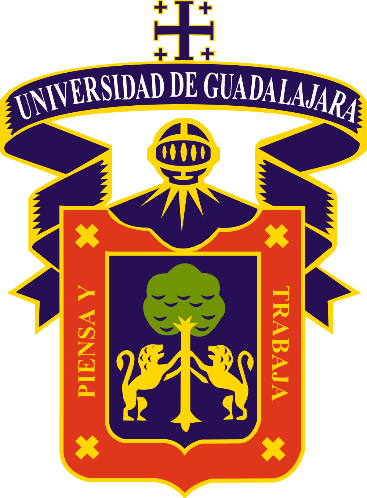{.fragment .img-shadow .img-centered data-fragment-index="9" fig-alt="Universidad de Guadalajara" fig-cap="Universidad de Guadalajara" fig-align="center" width="80%"}

## Practicas profesionales en la Universidad del Mar

::: columns
::: {.column}
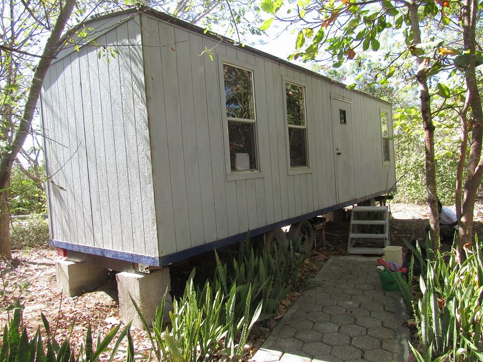{.fragment .img-shadow data-fragment-index="11" fig-alt="Paleomóvil 2015" fig-cap="Paleomóvil 2015" fig-align="center" width="100%"}
:::
::: {.column}

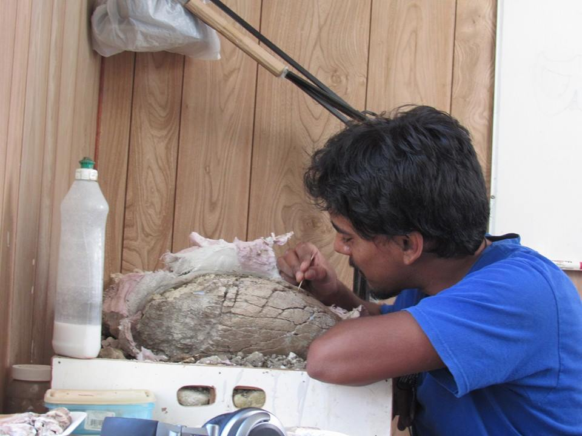{.fragment .img-shadow data-fragment-index="12" fig-alt="Prácticas profesionales" fig-cap="Prácticas profesionales" fig-align="center" width="100%" style="margin-top:0.75rem;"}
:::
:::

## El fósil misterioso

- ¿Qué es esto?

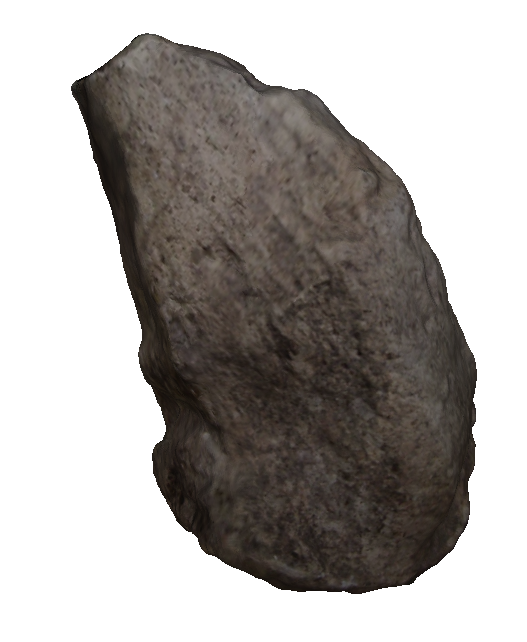{.fragment .img-shadow .img-centered data-fragment-index="10" fig-alt="Fósil desconocido" fig-cap="Fósil desconocido" fig-align="center" width="70%"}

## Misterio resuelto

- Metacarpal de un proboscideo 

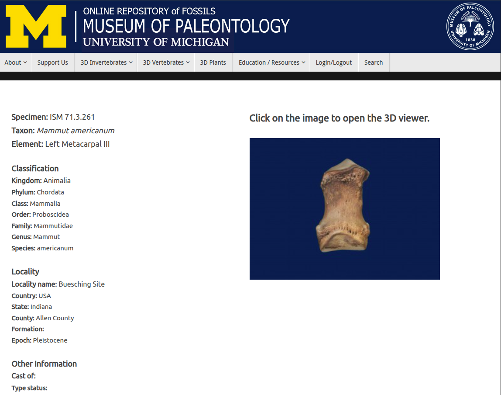{.fragment .img-shadow .img-centered data-fragment-index="13" fig-alt="Metacarpal disponible en UMORF" fig-cap="Metacarpal disponible en UMORF" fig-align="center" width="80%"}

## Regreso a casa

::: columns
::: {.column}
- Tesis de licenciatura: "Manual de Fotogrametría en Paleontología: Cómo crear modelos 3D de fósiles"

:::
::: {.column}

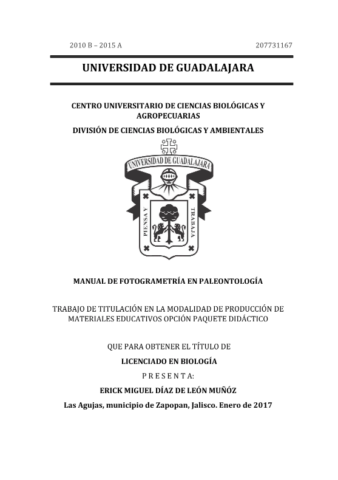{.fragment .img-shadow .img-centered data-fragment-index="14" fig-alt="Portada de la tesis" fig-cap="Portada de la tesis" fig-align="center" width="60%"}

:::
:::

# Museo Virtual Nacional

- Nacimiento del Museo Virtual Nacional (2015)
- Proyecto de divulgación científica y educación en paleontología

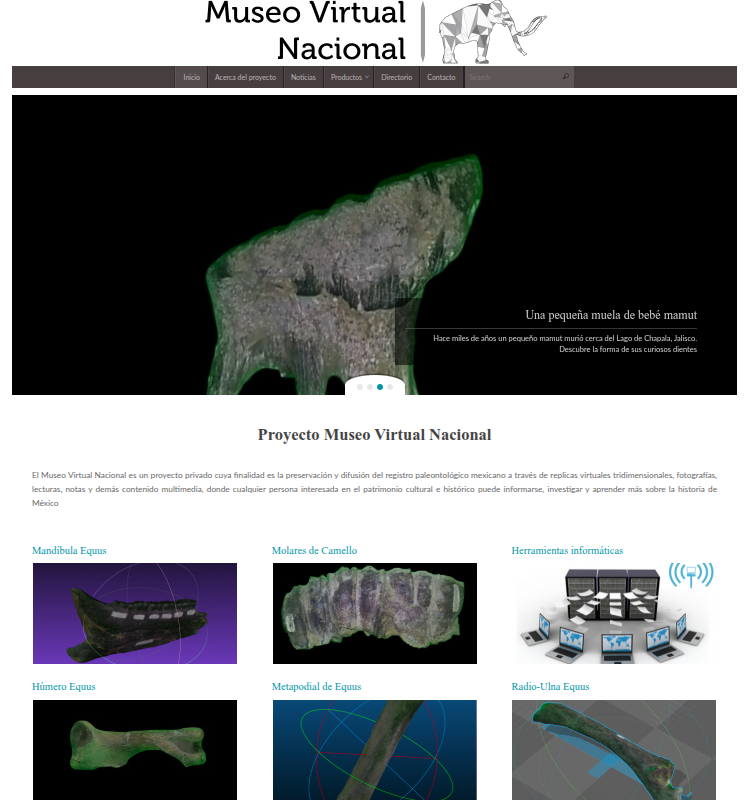{.fragment .img-shadow .img-centered data-fragment-index="15" fig-alt="Museo Virtual Nacional" fig-cap="Museo Virtual Nacional" fig-align="center" width="80%"}

# Preparándose para el siguiente paso

- Curso propedeútico para maestría en ciencias de la tierra (2016)

::: columns
::: {.column}
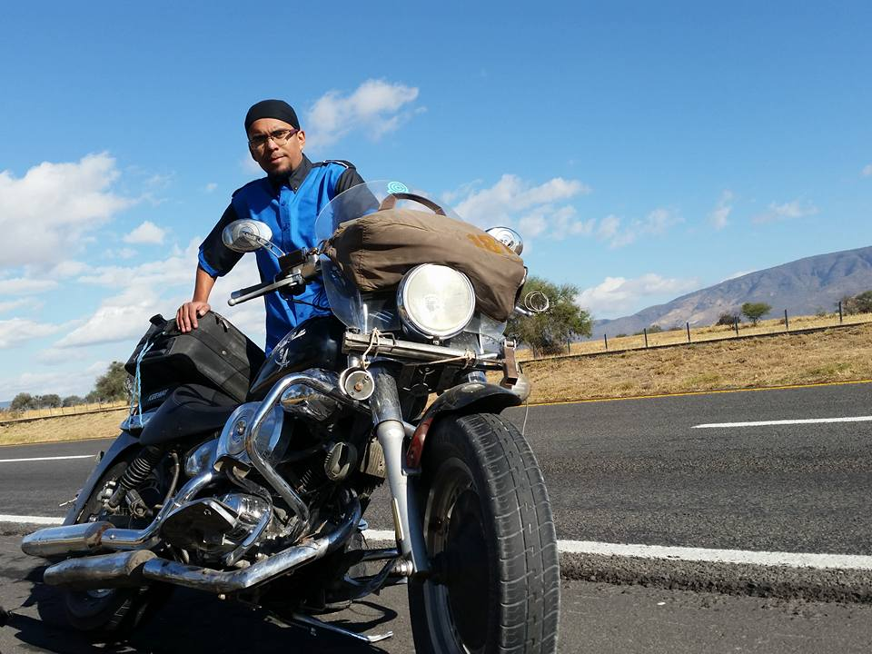{.fragment .img-shadow data-fragment-index="17" fig-alt="Camino a Morelia" fig-cap="Camino a Morelia" fig-align="center" width="100%"}
:::
::: {.column}

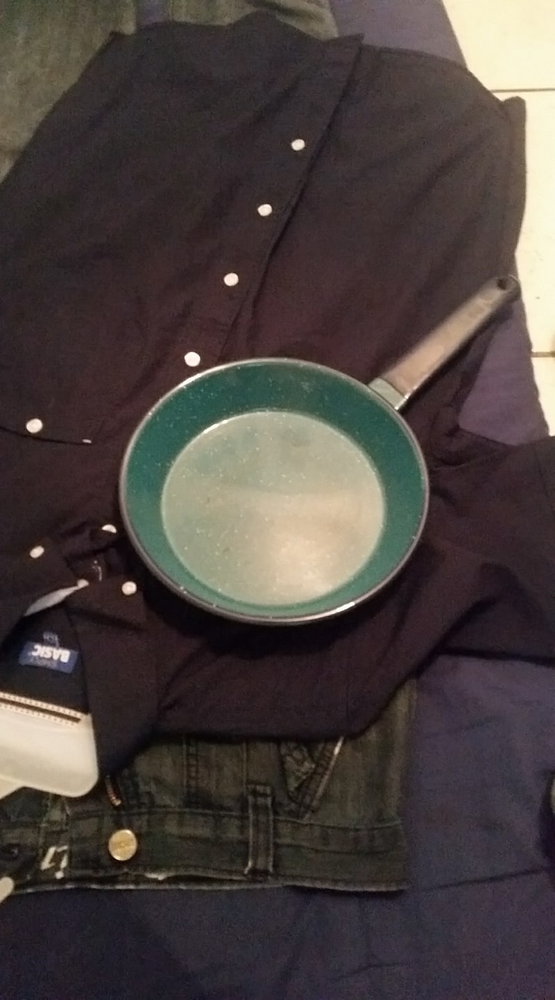{.fragment .img-shadow .img-centered data-fragment-index="17" fig-alt="Morelia 2017" fig-cap="Morelia 2017" fig-align="center" width="80%"}

:::
:::

# Maestría en Ciencias de la Tierra (UNAM)

- Enfoque en paleontología de vertebrados
- Becario del Consejo Nacional de Ciencia y Tecnología (CONACYT)

{.fragment .img-shadow .img-centered data-fragment-index="16" fig-alt="Trabajo de campo" fig-cap="Trabajo de campo" fig-align="center" width="80%"}

# Cuando el mundo se hace pequeño

- Visita a colección científica del Museo Americano de Historia Natural (2018)

::: columns
::: {.column width="33%"}
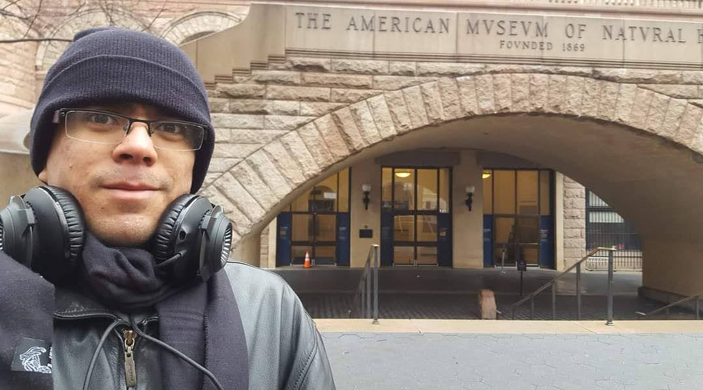{.fragment .img-shadow .img-centered data-fragment-index="18" fig-alt="AMNH 2018" fig-cap="AMNH 2018" fig-align="center" width="100%"}
:::
::: {.column width="33%"}
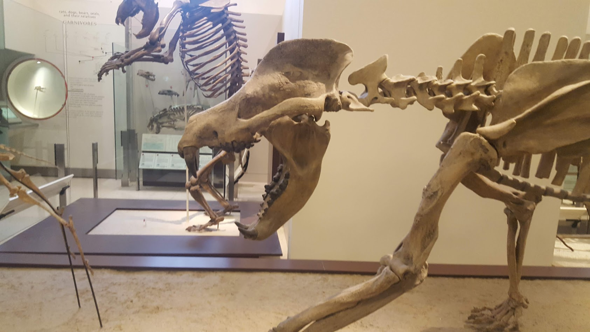{.fragment .img-shadow .img-centered data-fragment-index="19" fig-alt="Amphicyonidae" fig-cap="Amphicyonidae" fig-align="center" width="100%"}
:::
::: {.column width="33%"}
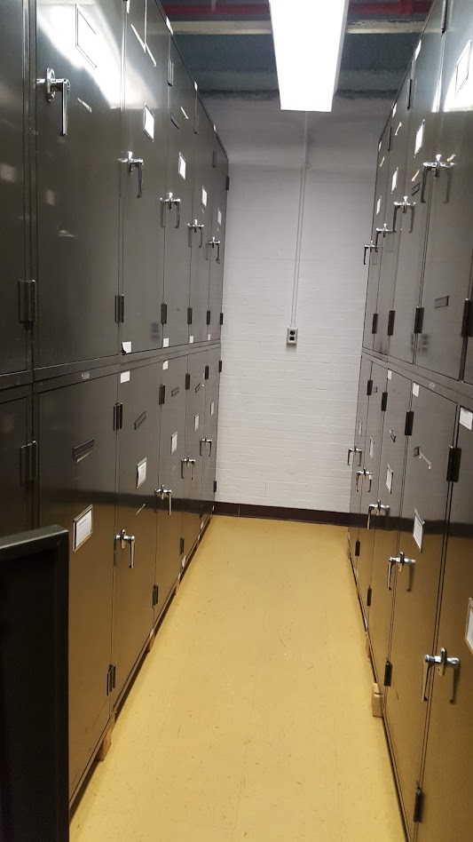{.fragment .img-shadow .img-centered data-fragment-index="20" fig-alt="Colección del AMNH" fig-cap="Colección del AMNH" fig-align="center" width="100%"}
:::
:::

# Las vueltas que da la vida

::: columns
::: {.column}
::: {style="max-width:960px; margin:0 auto;"}
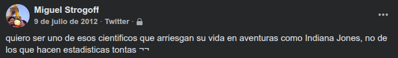{.img-shadow .img-centered fig-alt="Post en facebook 2010" fig-cap="Post en facebook 2010" fig-align="center" width="100%"}
:::

:::
::: {.column}
::: {style="position:relative; max-width:960px; margin:0 auto;"}
  <!-- Portada se superpone al post cuando aparece (fragment posterior) -->
  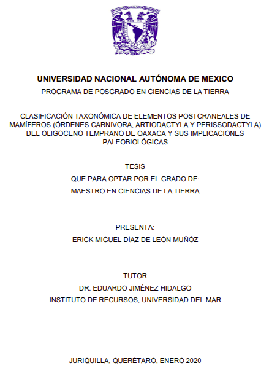{.fragment .img-overlap data-fragment-index="1" fig-alt="Portada de la tesis de maestría" fig-cap="Portada de la tesis de maestría" fig-align="center"}
:::

:::
:::

# Tocando puertas

- Becas Conahcyt para doctorado en el extranjero (suspendidas)
- Aplicación a proyectos con financiamiento (múltiples rechazos)

# Doctorado en Geociencias (Universidad de Tübingen)

::: columns
::: {.column}

- Enfoque en técnicas de análisis de datos en paleontología y paleontología virtual
- Becario del Servicio Alemán de Intercambio Académico (DAAD)
- Becario de la Secretaría de Ciencia, Humanidades, Tecnología e Innovación (SECIHTI)

:::

::: {.column}
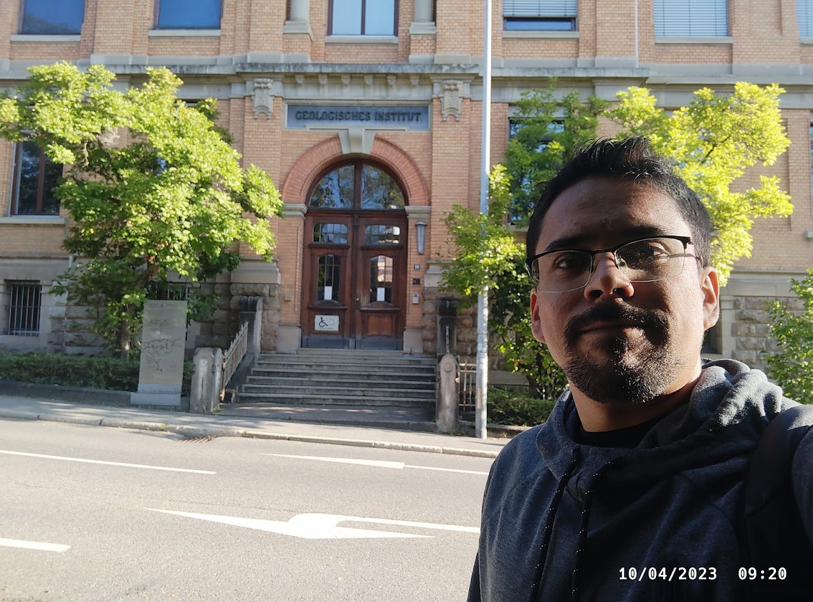{.fragment .img-shadow .img-centered data-fragment-index="21" fig-alt="Instituto de Geología - Tübingen" fig-cap="Instituto de Geología - Tübingen" fig-align="center" width="80%"}

:::
::: 

# Sobre mi trabajo

- Enfoque en técnicas de análisis de datos en paleontología y paleontología virtual
- Técnicas utilizadas en mi trabajo: 
  - Análisis de Elementos Finitos
  - Reconstrucción muscular
  - Análisis de morfometría geométrica

# ¿Qué es la paleontología virtual?

La paleontología virtual es una disciplina emergente que utiliza tecnologías digitales para estudiar fósiles y reconstruir el pasado. Como herramienta digital, utiliza principalmente modelos 3D, escaneo láser y reconstrucción digital.

::: {.r-stack}
{.fragment width=50%}

{.fragment width=50%}

:::
---

# Modelos 3D

La creación de lo modelos 3D para estudios paleontológicos se basa en tres técnicas principales:

---

**Escaneo láser**. Se utilizan dispositivos de escaneo láser para capturar la forma de los fósiles.

  

---

**Fotogrametría**. Se toman fotografías de los fósiles desde diferentes ángulos y se procesan con software especializado.

---

**Tomografía computarizada**. Se toman imágenes de secciones transversales mediante rayos-X de los fósiles y se reconstruyen en 3D.

---

# Principales usos de los modelos 3D en paleontología:

-  Preservación del patriomonio paleontológico.
-  Difusión del conocimiento.
-  Reconstrucción de la vida de los organismos extintos.

::: {.fragment .highlight-red fragment-index=1}
- Análisis biomecánico.
- Estudio de la morfología de los fósiles.
:::

---

# 1. Morfometría Geométrica: Estudio de la forma de los fósiles 

::: {.fragment fragment-index=1}
¿Cómo describir la forma de esta figura?
:::

  

  

  

---

# 1. Morfometría Geométrica: Anatomía Comparada

::: {.fragment fragment-index=1}
En paleontología, cuando se describe una nueva especie, es necesario describir su forma y compararla con otras especies. 
:::

::: {.fragment fragment-index=2}
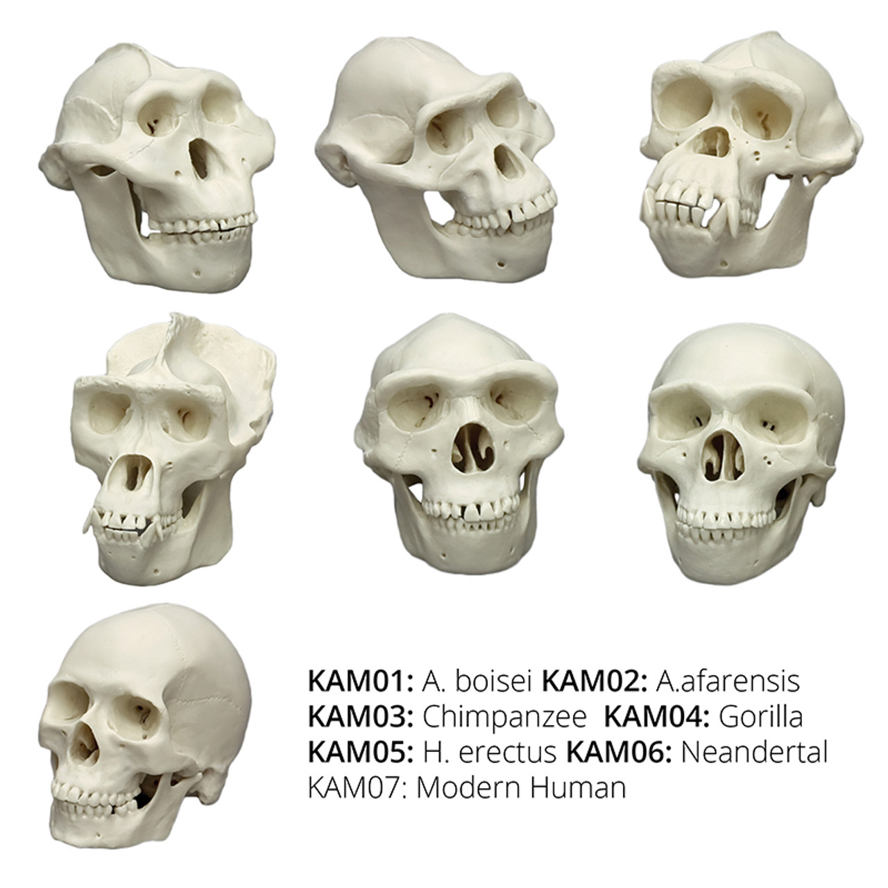{width=35%}
:::

---

# 1. Morfometría Geométrica: De lo cualitativo a lo cuantitativo

::: {.fragment fragment-index=1}
La morfometría geométrica permite cuantificar la forma de los fósiles y compararla estadísticamente.
:::

---

# 1. Morfometría Geométrica: Morfometría 2D

::: {.fragment fragment-index=2}
Para usar esta técnica podemos tomar fotografías de los fósiles y marcar puntos anatómicos en ellos que sean homólogos entre las diferentes especies.
:::

::: {.fragment fragment-index=3}
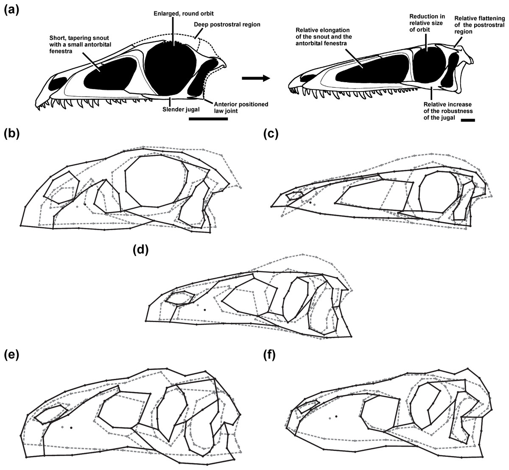{width=35%}
:::

---

# 1. Morfometría Geométrica: Morfometría 3D

::: {.fragment fragment-index=1}
Con modelos 3D podemos marcar puntos anatómicos en los fósiles y comparar la forma de los fósiles en 3D.
:::

::: {.fragment fragment-index=2}
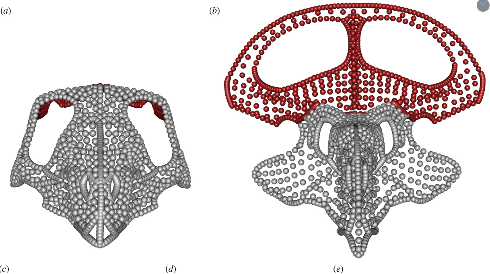{width=35%}
:::

---

# 1. Morfometría Geométrica: ¿Y qué hacemos con los datos?

::: {.fragment fragment-index=1}
Con los datos obtenidos de la morfometría geométrica podemos hacer análisis estadísticos para comparar la forma de los fósiles.
:::

::: {.columns}
::: {.column width="50%"}
::: {.fragment fragment-index=2}
Podemos por ejemplo comparar como la forma:

- Cambia a lo largo del tiempo.
- Cambia entre diferentes especies.
- Cambia entre diferentes sexos.
- Cambia entre diferentes poblaciones.
- Una forma particular se relaciona con una función particular.
:::
:::
::: {.column width="50%"}
::: {.fragment fragment-index=2}
{width=100%}
:::
:::
:::

---

# 2. Análisis Biomecánico: Estudio de la función de los fósiles

::: {.columns}
::: {.column width="50%"}
::: {.fragment fragment-index=1}
Algunas preguntas que podemos responder con análisis biomecánicos son:

- ¿Qué tan rápido corría una especie de dinosaurio?
- ¿Qué tan fuerte mordía un mamífero extinto?
- ¿Qué tan rápido nadaba un pez extinto?
- ¿Podía este animal volar?
- ¿Podía este animal trepar?
- ¿Podía este animal cavar?
:::
:::
::: {.column width="50%"}
::: {.fragment fragment-index=1}
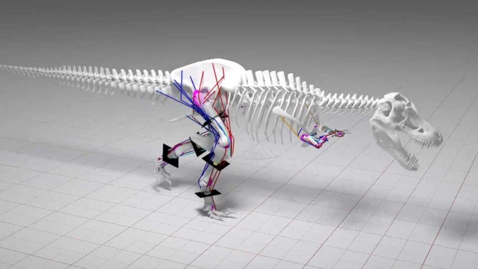{width=100%}
:::
:::
:::

--- 

# 2. Análisis Biomecánico: ¿Qué necesitamos para hacer un análisis biomecánico 3D?

::: {.columns}
::: {.column width="50%"}
::: {.fragment data-fragment-index="1"}
Para hacer un análisis biomecánico 3D necesitamos:

- Un modelo 3D del fósil.
- Un software que nos permita editar el modelo 3D.
- Un software que nos permita hacer simulaciones de la función del fósil.
:::
:::
::: {.column width="50%"}
::: {.fragment data-fragment-index="2"}
{width=40%}
:::
::: {.fragment data-fragment-index="3"}
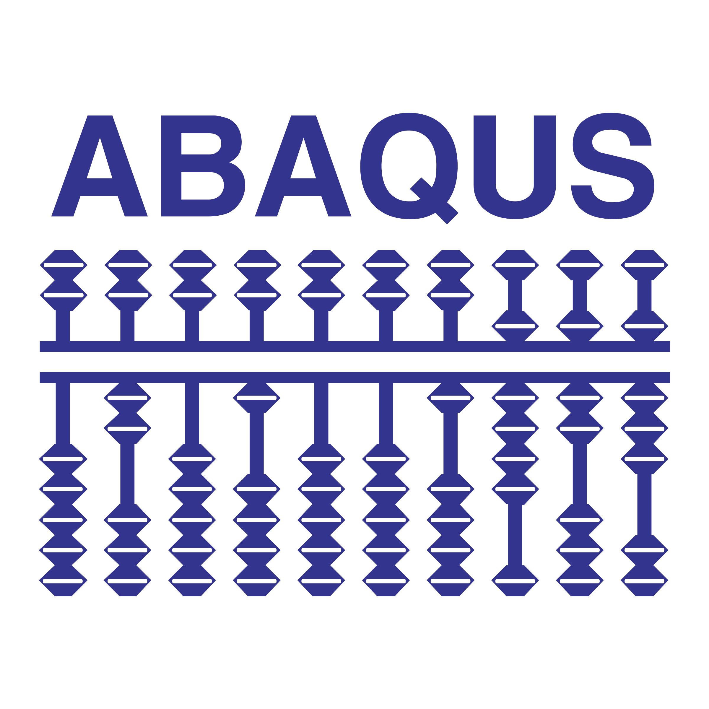{width=30%}
:::
:::
:::

---

# 2. Análisis Biomecánico: Análisis de Elementos Finitos (FEA)

::: {.fragment fragment-index=1}
Una técnica común para hacer análisis biomecánicos es el análisis de elementos finitos.
:::

::: {.fragment fragment-index=2}
En este tipo de análisis se divide el modelo 3D en elementos finitos y simula la reacción del fósil a diferentes fuerzas.
:::

::: {.fragment fragment-index=3}

:::

---

# 2. Análisis Biomecánico: Análisis de Elementos Finitos (FEA)

::: {.columns}
::: {.column width="50%"}
::: {.fragment fragment-index=1}
Existen muchos tipos de análisis de elementos finitos, uno de los más comunes es analizar la distribución de las fuerzas musculares en los fósiles y cómo estas fuerzas se distribuyen en el hueso. Con este tipo de análisis podemos, por ejemplo, estimar la fuerza de mordida de un animal extinto.
:::
:::
::: {.column width="50%"}
::: {.fragment fragment-index=2}
{width=100%}
:::
:::
:::

---

# 2. Análisis Biomecánico: Análisis de Elementos Finitos (FEA)

::: {.columns}
::: {.column width="50%"}
::: {.fragment fragment-index=1}
Para poder estimar la fuerza de mordida de un animal extinto necesitamos:

- Un modelo 3D del cráneo del animal.
- Reconstruir los músculos de la mandíbula y el cráneo.
- Definir las fuerzas de los músculos.
- Definir las propiedades mecánicas de los músculos y los huesos.
- Definir las condiciones de la simulación.
:::
:::
::: {.column width="50%"}
::: {.fragment fragment-index=2}
{width=100%}
:::
:::
:::

---

# 2. Análisis Biomecánico: Análisis de Elementos Finitos (FEA)

::: {.columns}
::: {.column width="50%"}
::: {.fragment fragment-index=1}
En este ejemplo podemos ver cómo investigadores han usado análisis de elementos finitos para estimar la fuerza de mordida de el *Tyrannosaurus rex* de diferentes edades.

Los investigadores llegaron a la conclusión de que los individuos juveniles no tenían una mordida relativamente fuerte como para romper huesos.
:::
:::
::: {.column width="50%"}
::: {.fragment fragment-index=2}
{width=50%}
:::
:::
:::

---

# 2. Análisis Biomecánico: Biomecánica muscular

::: {.fragment fragment-index=1}
Otro tipo de análisis biomecánico que se puede hacer con modelos 3D es el análisis de la biomecánica muscular.
:::

::: {.columns}
::: {.column width="50%"}
::: {.fragment fragment-index=2}
Con este tipo de estudios podemos por ejemplo:

- Estimar la fuerza de mordida
- Estimar el ángulo de apertura o máximo rango de movimiento de un hueso
- Estimar la velocidad de cierre de la mandíbula
:::
:::
::: {.column width="50%"}
::: {.fragment fragment-index=3}
{width=100%}
:::
:::
:::

---

# 2. Análisis Biomecánico: Estimación de apertura máxima de la mandíbula

::: {.fragment fragment-index=1}
Usando modelos 3D del cráneo y la mandíbula, podemos estimar el ángulo de apertura máxima.
:::

::: {.columns}
::: {.column width="50%"}
::: {.fragment fragment-index=2}
Para esto necesitamos:

- Un modelo 3D del cráneo y la mandíbula.
- Definir las articulaciones de la mandíbula.
- Definir los puntos de inserción de los músculos.
- Definir las propiedades mecánicas de los músculos (Cuánto se puede estirar, usualamente se usa un valor máximo de 1.7 veces)
- Definir las condiciones de la simulación.
:::
:::
::: {.column width="50%"}
::: {.fragment fragment-index=3}
{width=100%}
:::
:::
:::

---

# 2. Análisis Biomecánico: Estimación de apertura máxima de la mandíbula

::: {.fragment fragment-index=1}
Usando este enfoque, Lautenschlager (2015) estimó la apertura máxima de tres especies de dinosaurios terópodos (*Tyrannosaurus rex*, *Allosaurus fragilis* y *Erlikosaurus andrewsi*).
:::

::: {.fragment fragment-index=2}
{width=30%}
:::

---

# 3. Análisis Biométrico: Estudio de apertura máxima de la mandíbula

::: {.fragment fragment-index=1}
Ejemplo animado de la estimación de la apertura máxima de un lobo
:::

::: {.fragment fragment-index=2}
{width=100%}
:::

---

# 3. Análisis Biométrico: Estudio de apertura máxima de la mandíbula

::: {.fragment fragment-index=1}
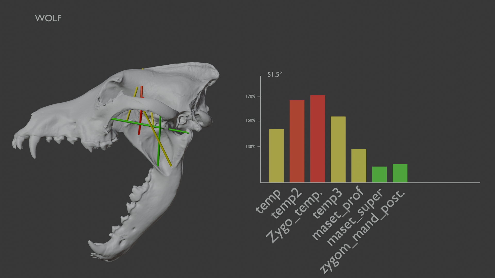{width=100%}
:::

---

# 3. Análisis Biométrico: Estudio de apertura máxima de la mandíbula

::: {.fragment fragment-index=1}
Ejemplo de la tasa de crecimiento del músculo masseter en un lobo
:::

::: {.fragment fragment-index=2}

  <iframe src="images/growth_proportion.html" width="800px" height="800px"></iframe>

:::
---

# 3. Análisis Biométrico: Otras aplicaciones posibles

{width=100%}

---

# Cierre

- Si estás interesado en enfoques modernos y poco explorados en tu carrera, busca oportunidades para aprender sobre ellos, aunque no estén disponibles en tu institución.
- No tengas miedo de tocar puertas y explorar oportunidades en otros lugares, incluso en el extranjero.
- Tendrás que salir de tu zona de confort, pero eso es parte del proceso de crecimiento como científico.
- Las oportunidades no siempre llegan a ti, a veces tienes que salir a buscarlas.
 
---

# Gracias por su atención

- Contacto:
  - Correo electrónico: [migueldlm1307@gmail.com](mailto:migueldlm1307@gmail.com)
  - Museo Virtual Nacional: [museovirtualnacional.com](https://museovirtualnacional.com)