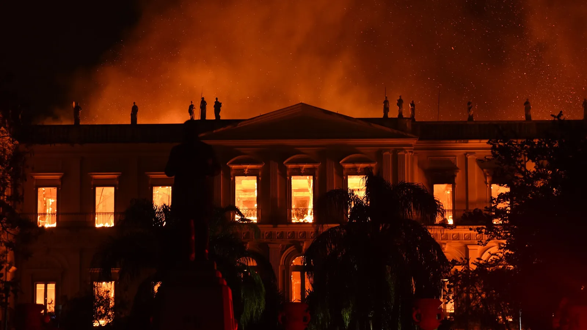
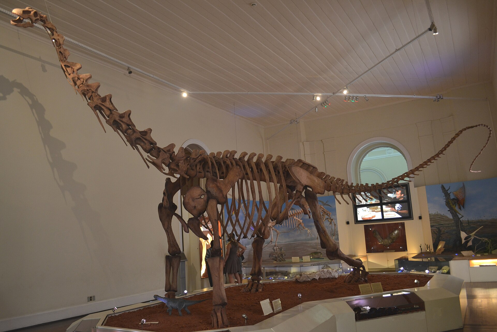
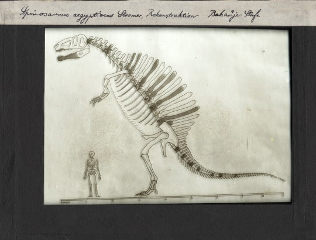
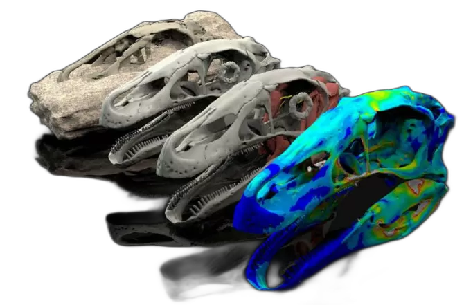
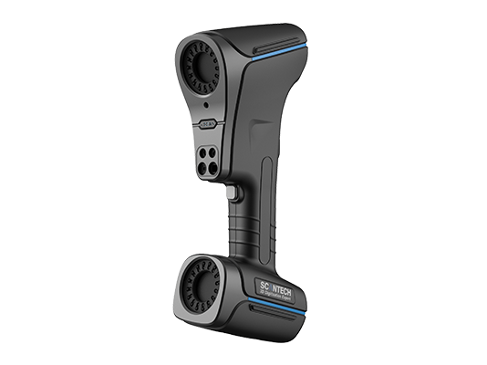
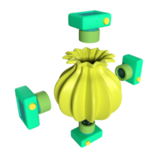
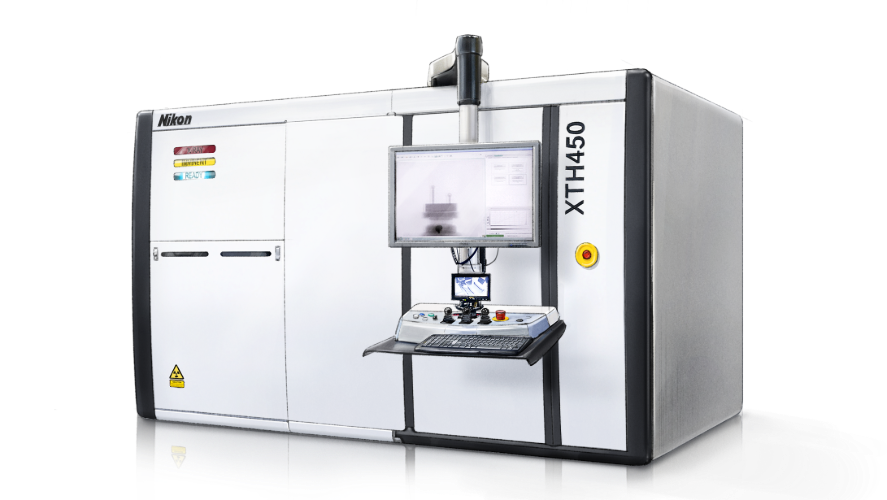

# Motivación {background-color="#1E2B3A"}

## Los fósiles son únicos e irremplazables

- **Unicidad:** No existe un respaldo físico; cada fósil es irrepetible.
- **Vulnerabilidad:** La manipulación y el estudio físico pueden causar daños irreversibles.
- **Inaccesibilidad:** Barreras geográficas y costos de transporte limitan la investigación.
- **Riesgo catastrófico:** Guerras, desastres e incendios han destruido especímenes para siempre.

## Caso 1: El incendio del Museo Nacional de Brasil (2018)

::: {.columns}
::: {.column width="55%"}
{.img-shadow width="100%"}
:::
::: {.column width="45%"}
- Más de **20 millones de especímenes** destruidos: fósiles, insectos, esqueletos, grabaciones etnográficas.
- Entre ellos, **Luzia**: uno de los seres humanos más antiguos conocidos de América
- La mayoría de las colecciones paleontológicas **no tenían registro digital**.
- Pérdida científica incalculable e irreversible.
:::
:::

## Caso 1: La digitalización de *Maxakalisaurus topai*

::: {.columns}
::: {.column width="55%"}
{.img-shadow width="100%"}
:::
::: {.column width="45%"}
- Titanosaurio del Cretácico de Brasil, alojado en el Museo Nacional.
- Fue **digitalizado después del incendio** gracias a que existían moldes y réplicas físicas
:::
:::

## Caso 2: *Spinosaurus aegyptiacus* y la Segunda Guerra Mundial

::: {.columns}
::: {.column width="55%"}
- Ernst Stromer describió *Spinosaurus* en **1915** a partir de material colectado en Egipto.
- Los especímenes tipo se conservaban en el **Museo Estatal de Historia Natural de Baviera**, Munich.
- En **abril de 1944**, los bombardeos aliados destruyeron el museo.
- Los únicos fósiles originales de *Spinosaurus* desaparecieron para siempre [@ibrahimSemiaquaticAdaptationsGiant2014].
- Durante décadas fue imposible re-estudiar el espécimen — hasta que nuevos fósiles aparecieron en 2008.
:::
::: {.column width="45%"}
{.img-shadow width="100%"}
:::
:::


## Preguntas clave

- ¿Cómo estudiarlos sin destruirlos?
- ¿Cómo hacer que un fósil en Alemania pueda ser estudiado desde México?
- ¿Y si el fósil se pierde o destruye?
- ¿Cómo preservar su información para futuras generaciones?


# ¿Qué es la Paleontología Virtual? {background-color="#1E2B3A"}

## La paleontología virtual resuelve el problema del acceso y la preservación

La paleontología virtual es el estudio de los fósiles a través de **representaciones digitales interactivas**. Emplea tecnologías computacionales y de imagen de vanguardia para obtener información nueva sin necesidad de manipular el espécimen físico [@suttonTechniquesVirtualPalaeontology2014].

::: {.r-stack}

:::


## Virtual ≠ Computacional: dos enfoques complementarios

::: {.columns}
::: {.column width="50%"}
### Paleontología Virtual
- **Enfoque:** Captura y reconstrucción
- **Objetivo:** Obtener el "fósil digital"
- **Herramientas:** CT, escaneo láser, fotogrametría
- **Resultado:** Modelo 3D fiel al espécimen [@suttonTechniquesVirtualPalaeontology2014]
:::
::: {.column width="50%"}
### Paleontología Computacional
- **Enfoque:** Modelado matemático y simulación
- **Objetivo:** Analizar e interpretar
- **Herramientas:** Software de análisis estadístico, biomecánico y morfométrico
- **Resultado:** Hipótesis cuantificadas [@elewaComputationalPaleontology2011]
:::
:::

::: {.fragment}
> El modelo 3D es el puente entre ambas disciplinas.
:::

## Mapeando el Territorio Digital

```{=html}
<div style="text-align: center; margin-top: 10px;">
<svg viewBox="0 0 1000 500" width="100%" height="55vh">
  <!-- Outer circle: Paleontología Computacional -->
  <circle cx="500" cy="250" r="230" fill="rgba(42, 125, 140, 0.15)" stroke="#2A7D8C" stroke-width="4"/>
  <text x="500" y="70" fill="#1A1F27" font-size="32" font-family="sans-serif" font-weight="bold" text-anchor="middle">Paleontología</text>
  <text x="500" y="110" fill="#1A1F27" font-size="32" font-family="sans-serif" font-weight="bold" text-anchor="middle">Computacional</text>
  
  <!-- Inner circle: Paleontología Virtual -->
  <circle cx="500" cy="330" r="150" fill="rgba(196, 130, 10, 0.25)" stroke="#C4820A" stroke-width="4"/>
  <text x="500" y="320" fill="#1A1F27" font-size="32" font-family="sans-serif" font-weight="bold" text-anchor="middle">Paleontología</text>
  <text x="500" y="360" fill="#1A1F27" font-size="32" font-family="sans-serif" font-weight="bold" text-anchor="middle">Virtual</text>

  <!-- Left Callouts (Computacional) -->
  <!-- 1 -->
  <path d="M 280 120 L 350 150" stroke="#2A7D8C" stroke-width="2"/>
  <circle cx="350" cy="150" r="5" fill="#2A7D8C"/>
  <rect x="50" y="90" width="230" height="60" rx="8" fill="#1E2B3A" stroke="#2A7D8C" stroke-width="2"/>
  <text x="165" y="127" fill="#FFF" font-family="sans-serif" font-size="18" text-anchor="middle">Algoritmos estadísticos</text>
  
  <!-- 2 -->
  <path d="M 280 250 L 320 250" stroke="#2A7D8C" stroke-width="2"/>
  <circle cx="320" cy="250" r="5" fill="#2A7D8C"/>
  <rect x="50" y="220" width="230" height="60" rx="8" fill="#1E2B3A" stroke="#2A7D8C" stroke-width="2"/>
  <text x="165" y="257" fill="#FFF" font-family="sans-serif" font-size="18" text-anchor="middle">Paleoinformática</text>

  <!-- 3 -->
  <path d="M 280 380 L 330 350" stroke="#2A7D8C" stroke-width="2"/>
  <circle cx="330" cy="350" r="5" fill="#2A7D8C"/>
  <rect x="50" y="350" width="230" height="60" rx="8" fill="#1E2B3A" stroke="#2A7D8C" stroke-width="2"/>
  <text x="165" y="377" fill="#FFF" font-family="sans-serif" font-size="16" text-anchor="middle">Bases de datos</text>
  <text x="165" y="397" fill="#FFF" font-family="sans-serif" font-size="14" text-anchor="middle">(ej. Sepkoski)</text>

  <!-- Right Callouts (Virtual) -->
  <!-- 1 -->
  <path d="M 720 160 L 610 230" stroke="#C4820A" stroke-width="2"/>
  <circle cx="610" cy="230" r="5" fill="#C4820A"/>
  <rect x="720" y="130" width="230" height="60" rx="8" fill="#1E2B3A" stroke="#C4820A" stroke-width="2"/>
  <text x="835" y="167" fill="#FFF" font-family="sans-serif" font-size="18" text-anchor="middle">Visualización 3D</text>

  <!-- 2 -->
  <path d="M 720 290 L 640 290" stroke="#C4820A" stroke-width="2"/>
  <circle cx="640" cy="290" r="5" fill="#C4820A"/>
  <rect x="720" y="260" width="230" height="60" rx="8" fill="#1E2B3A" stroke="#C4820A" stroke-width="2"/>
  <text x="835" y="297" fill="#FFF" font-family="sans-serif" font-size="18" text-anchor="middle">Interacción espacial</text>

  <!-- 3 -->
  <path d="M 720 420 L 610 395" stroke="#C4820A" stroke-width="2"/>
  <circle cx="610" cy="395" r="5" fill="#C4820A"/>
  <rect x="720" y="390" width="230" height="60" rx="8" fill="#1E2B3A" stroke="#C4820A" stroke-width="2"/>
  <text x="835" y="427" fill="#FFF" font-family="sans-serif" font-size="18" text-anchor="middle">Escaneo y Tomografía</text>
</svg>
</div>
```

::: {.venn-caption style="font-size: 0.8em; text-align: center; padding: 15px; background: rgba(30,43,58,0.05); border-radius: 8px; border-left: 4px solid #C4820A; margin: 0 auto; max-width: 90%;"}
**Toda la paleontología virtual es computacional, pero no viceversa.** Mientras la computacional maneja números y bases de datos a gran escala, la virtual se enfoca en la representación e interacción geométrica 3D del fósil.
:::

# Digitalización 3D {background-color="#1E2B3A"}

## Tres tecnologías producen los modelos 3D 

::: {.columns}
::: {.column width="33%"}
### Escaneo láser
Dispositivos de luz estructurada o láser capturan la geometría superficial del fósil con alta precisión.

{width="80%"}
:::
::: {.column width="33%"}
### Fotogrametría
Fotografías desde múltiples ángulos son procesadas por software para reconstruir la forma en 3D.

{width="80%"}
:::
::: {.column width="33%"}
### Tomografía computarizada (CT)
Rayos-X en secciones transversales permiten visualizar el interior del fósil sin destruirlo.

{width="80%"}
:::
:::

::: {.fragment}
*Los Días 2 y 3 cubriremos el flujo de trabajo completo de cada técnica.*
:::

## Cada técnica tiene su dominio de aplicación

| | Escaneo láser | Fotogrametría | Tomografía CT |
|:--|:--:|:--:|:--:|
| **Superficie externa** | ✓ | ✓ | ✓ |
| **Estructura interna** | — | — | ✓ |
| **Costo** | Medio | Bajo | Alto |
| **Portabilidad** | Media | Alta | Baja |
| **Resolución** | Alta | Media-Alta | Muy alta |

# Formatos de Modelos 3D {background-color="#1E2B3A"}

## Todo modelo 3D es una malla definida por elementos geométricos

::: {.columns}
::: {.column width="50%"}
### Los elementos de una malla

| Concepto | También llamado en… |
|:---|:---|
| **Vértice** | *Node* (FEA/VTK), *point* (PCL, VTK) |
| **Arista** | *Edge*, *bond*, *half-edge* (Blender) |
| **Cara** | *Face*, *polygon*, *facet*, *triangle* |
| **Celda** | *Cell*, *element* (FEA), *voxel* (CT) |
| **Normal** | *Face normal*, *vertex normal* |
| **UV** | *Texture coordinate*, *texcoord* |
:::
::: {.column width="50%"}
### Tipos de malla

- **Superficie** (*surface mesh*): solo caras externas — STL, OBJ, PLY
- **Volumétrica** (*volumetric mesh*): incluye el interior — VTK, MSH, XDMF
- **Nube de puntos** (*point cloud*): solo vértices, sin conectividad — XYZ, LAS, E57

::: {.fragment}
> Blender usa *vértices, aristas y caras*. VTK habla de *points, cells y connectivity array*. Son lo mismo con distinto nombre.
:::
:::
:::

## Los cuatro formatos más usados en paleontología digital

| Formato | Tipo | Ventajas | Desventajas |
|:---|:---:|:---|:---|
| **STL** | Superficie | Universal, simple, 3D printing | Sin color, sin textura, sin escala |
| **OBJ** | Superficie | Color, UV, materiales (MTL), amplio soporte | Texto plano, pesado, multiples archivos |
| **PLY** | Superficie | Color por vértice, binario o texto, ligero | Soporte de textura limitado |
| **VTK** | Volumétrico | FEA, CFD, datos escalares/vectoriales por celda | Poco soporte en software de modelado |

## STL y OBJ: portabilidad máxima

::: {.columns}
::: {.column width="50%"}
### STL — *Stereolithography*
- Inventado en 1987 para impresión 3D.
- Solo triángulos: cada cara tiene 3 vértices y una normal.
- **ASCII** (legible) o **binario** (6× más compacto).
- Ningún software lo rechaza.
- **Úsalo cuando:** exportas para imprimir o para compatibilidad máxima.
- **Evítalo cuando:** necesitas color o textura.
:::
::: {.column width="50%"}
### OBJ — *Wavefront Object*
- Estándar de facto para intercambio con textura.
- Acompañado de un archivo `.mtl` (materiales) y archivos de imagen.
- Soporta polígonos n-lados (no solo triángulos).
- **Úsalo cuando:** necesitas color, UV o exportar a Sketchfab/MorphoSource.
- **Evítalo cuando:** el archivo supera ~500 MB (texto puro, muy lento).
:::
:::

## PLY y VTK: ciencia y análisis

::: {.columns}
::: {.column width="50%"}
### PLY — *Polygon File Format*
- Creado en Stanford (1994) para escaneo 3D científico.
- Soporta **propiedades arbitrarias** por vértice: color RGBA, intensidad, curvatura, coordenadas CT.
- Modo binario compacto y rápido de leer.
- **Úsalo cuando:** el escáner exporta PLY con color o datos adicionales.
- **Evítalo cuando:** necesitas textura UV mapeada.
:::
::: {.column width="50%"}
### VTK — *Visualization Toolkit*
- Formato de Kitware, diseñado para simulación científica.
- Almacena mallas volumétricas + **datos por celda o nodo**: tensión, temperatura, presión.
- Dos variantes: `.vtk` (legacy, texto/binario) y `.vtu` (XML, comprimible).
- **Úsalo cuando:** haces FEA, CFD o exportas resultados de simulación.
- **Evítalo cuando:** solo necesitas geometría para visualización.
:::
:::

## Herramientas para convertir entre formatos

::: {.columns}
::: {.column width="33%"}
### GUI (sin código)
- **MeshLab** — abre y exporta casi todo; filtros de calidad
- **Blender** — importa STL/OBJ/PLY/FBX; exporta con textura
- **ParaView** — especializado en VTK y datos científicos
- **3D Slicer** — CT → STL/OBJ/VTK *(Día 3)*
:::
::: {.column width="33%"}
### Python (por lotes)
- **meshio** — 40+ formatos; conserva datos científicos por celda
- **trimesh** — enfocado en mallas de superficie; más robusto con PLY
- **open3d** — nube de puntos y mallas; GPU-accelerated
- **pyvista** — envuelve VTK; gráficas científicas integradas
:::
::: {.column width="33%"}
### Línea de comandos
- **assimp** (`sudo apt install assimp-utils`) — convierte 40+ formatos en una línea
- **meshio-convert** — CLI incluido con meshio
- **ctmconv** — compresión OpenCTM
:::
:::

## Convertir una malla con Python: cuatro líneas

```python
import meshio

# Leer cualquier formato soportado
mesh = meshio.read("especimen.ply")

# Escribir en otro formato — meshio detecta el formato por la extensión
meshio.write("especimen.stl", mesh)
meshio.write("especimen.obj", mesh)
meshio.write("especimen.vtk", mesh)
```

::: {.fragment}
```python
# Con trimesh: más robusto para mallas de superficie con color
import trimesh

mesh = trimesh.load("especimen.ply", process=False)
mesh.export("especimen.obj")   # conserva color por vértice si el formato lo admite
```
:::

::: {.fragment}
*El script `convert_mesh.py` incluido en el curso automatiza esto para uno o varios archivos desde la terminal.*
:::

## Flujo de trabajo: convertir archivos con el script del curso

```bash
# 1. Crear el entorno virtual (solo la primera vez)
python3 -m venv venv
source venv/bin/activate          # Linux/Mac
# venv\Scripts\activate           # Windows

# 2. Instalar dependencias
pip install meshio trimesh

# 3. Convertir un archivo
python convert_mesh.py especimen.ply -f obj

# 4. Convertir varios archivos a la vez
python convert_mesh.py *.ply -f stl

# 5. Ver todos los formatos disponibles
python convert_mesh.py --list-formats
```

::: {.fragment}
::: {style="background:#1E2B3A; color:#FDFCF9; border-left:4px solid #C4820A; padding:0.8em 1.2em; border-radius:6px; font-size:0.82em;"}
**¿Por qué un entorno virtual?** Evita conflictos entre versiones de librerías de distintos proyectos. `meshio` y `trimesh` se instalan solo dentro de ese entorno y no afectan el resto del sistema.
:::
:::

# Repositorios y Bases de Datos {background-color="#1E2B3A"}

## MorphoSource

::: {.columns}
::: {.column width="40%"}
- Repositorio científico en morfología 3D.
- Decenas de miles de especímenes escaneados.
- Contiene datos de CT, escaneo láser y fotogrametría.
- Permite acceso a archivos originales (STL, PLY, OBJ).
- Facilita la citación académica de conjuntos de datos.

[morphosource.org](https://www.morphosource.org)
:::
::: {.column width="60%"}
```{=html}
<iframe src="https://www.morphosource.org" width="100%" height="600" style="border: 1px solid #ccc; border-radius: 8px;"></iframe>
```
:::
:::

## Sketchfab

::: {.columns}
::: {.column width="40%"}
- Plataforma líder de visualización 3D en la web.
- Ampliamente usada por museos y colecciones científicas.
- Permite la visualización interactiva sin necesidad de software especializado.
- Sus modelos son embebibles en páginas web.

[sketchfab.com](https://sketchfab.com)
:::
::: {.column width="60%"}
```{=html}
<iframe src="https://sketchfab.com" width="100%" height="600" style="border: 1px solid #ccc; border-radius: 8px;"></iframe>
```
:::
:::

## UMORF (University of Michigan)

::: {.columns}
::: {.column width="40%"}
- Repositorio del Museo de Paleontología de la Universidad de Michigan.
- Extenso catálogo de fósiles de vertebrados, invertebrados y modelos 3D interactivos.
- Orientado fuertemente a la educación y divulgación abierta en ciencias biológicas.

[umorf.ummp.lsa.umich.edu](https://umorf.ummp.lsa.umich.edu)
:::
::: {.column width="60%"}
```{=html}
<iframe src="https://umorf.ummp.lsa.umich.edu" width="100%" height="600" style="border: 1px solid #ccc; border-radius: 8px;"></iframe>
```
:::
:::

## DigiMorph

::: {.columns}
::: {.column width="40%"}
- Pionero en tomografía de alta resolución de vertebrados e invertebrados, operado por UT Austin.
- Incluye animaciones, secciones anatómicas y modelos de superficie.
- Colección extensa construida tras décadas de investigaciones morfológicas.

[digimorph.org](http://digimorph.org)
:::
::: {.column width="60%"}
```{=html}
<iframe src="http://digimorph.org" width="100%" height="600" style="border: 1px solid #ccc; border-radius: 8px;"></iframe>
```
:::
:::

## Phenome10K

::: {.columns}
::: {.column width="40%"}
- Biblioteca digital gratuita de microCT y escaneos de superficie.
- **Contenido:** Especies actuales y fósiles (cráneos, esqueletos y tejidos blandos).
- **Acceso:** Visualización libre; requiere cuenta gratuita para descargar archivos **STL**.
- **Origen:** Creado por la Dra. Anjali Goswami y mantenido por el **Natural History Museum** de Londres.

[phenome10k.org](https://phenome10k.org)
:::
::: {.column width="60%"}
```{=html}
<iframe src="https://phenome10k.org" width="100%" height="600" style="border: 1px solid #ccc; border-radius: 8px;"></iframe>
```
:::
:::

::: {.fragment}
*En la sesión práctica descargaremos y exploraremos especímenes de estos repositorios.*
:::

# Usos de los Modelos 3D {background-color="#1E2B3A"}

## Los modelos 3D abren cuatro grandes líneas de aplicación

::: {.columns}
::: {.column width="50%"}
**1. Preservación del patrimonio**

El modelo digital existe aunque el fósil sea dañado, perdido o destruido. Permite compartir sin riesgo de deterioro.

**2. Difusión del conocimiento**

Museos virtuales, exhibiciones interactivas y materiales educativos accesibles desde cualquier lugar.
:::
::: {.column width="50%"}
**3. Reconstrucción de organismos extintos**

Restaurar morfología perdida, reconstruir tejidos blandos y generar hipótesis sobre apariencia en vida.

**4. Análisis cuantitativo** *(lo que veremos en los Días 5–7)*

Morfometría, biomecánica y dinámica: estudiar forma y función sin tocar el fósil.
:::
:::

# Áreas de Análisis {background-color="#1E2B3A"}

## El modelo 3D es el punto de partida de cuatro grandes técnicas analíticas

Para biólogos y paleontólogos, la digitalización no es el fin sino el inicio del análisis:

::: {.fragment}
- **Morfometría Geométrica** — cuantificar y comparar formas estadísticamente *(Día 7)*
:::
::: {.fragment}
- **Análisis de Elementos Finitos (FEA)** — simular fuerzas, tensiones y deformaciones *(Día 6)*
:::
::: {.fragment}
- **Dinámica Multicuerpo (MDA)** — simular movimientos articulares y musculares *(Días 5–6)*
:::
::: {.fragment}
- **Dinámica de Fluidos (CFD)** — estudiar locomoción en medios acuáticos o aéreos
:::

## Un flujo de trabajo integrador conecta digitalización y análisis

```
Espécimen físico
     │
     ▼
Digitalización 3D ──────────── Días 2 y 3
(CT / Láser / Fotogrametría)
     │
     ▼
Optimización del modelo ─────── Día 4
(limpieza de malla, retopología)
     │
     ▼
Reconstrucción muscular ──────── Día 5
     │
     ▼
Análisis biomecánico / FEA ───── Día 6
     │
     ▼
Morfometría Geométrica ──────── Día 7
```

::: {.notes}
Estas áreas no están aisladas. Forman un ecosistema digital donde cada paso alimenta al siguiente y permite probar hipótesis de forma rigurosa y reproducible.
:::

# Conclusiones del Día 1 {background-color="#1E2B3A"}

## La paleontología virtual resuelve limitaciones fundamentales del trabajo con fósiles

- Los fósiles son **únicos e irremplazables** — la digitalización permite estudiarlos sin riesgo
- Tres tecnologías producen modelos 3D: **escaneo láser, fotogrametría y CT** — cada una con su dominio
- Repositorios como **MorphoSource y Sketchfab** hacen accesibles miles de especímenes digitales
- El modelo 3D es el inicio, no el fin: habilita **morfometría, biomecánica y simulación**
- La paleontología virtual es **interdisciplinaria**: combina paleontología, informática, ingeniería y biología

# Referencias {background-color="#1E2B3A" .scrollable style="font-size: 0.75em;"}

::: {#refs}
:::
