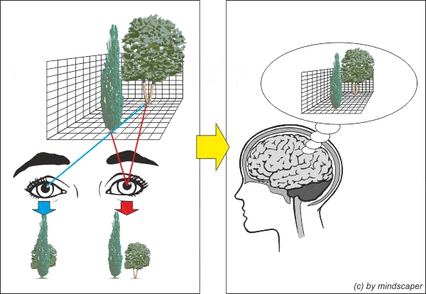
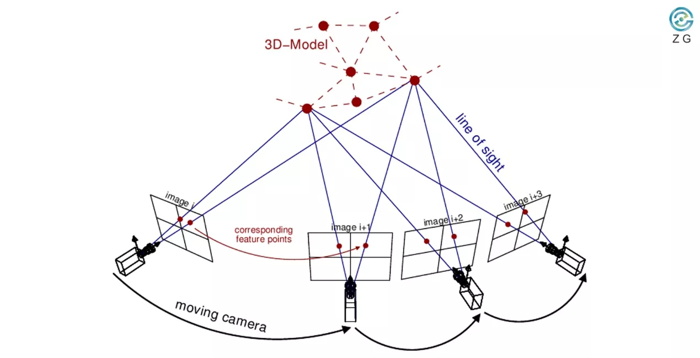
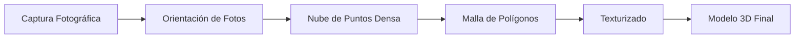

# Introducción {background-color="#1E2B3A"}

## ¿Qué es la fotogrametría?

> "Técnica cuyo objetivo es estudiar y definir con precisión la forma, dimensiones y posición en el espacio de un objeto utilizando esencialmente medidas sobre fotografías."

::: incremental
- **No es nueva:** Utilizada desde el siglo XIX (Albrecht Meydenbauer).
- **Evolución:** De la documentación arquitectónica a la digitalización 3D masiva.
- **En Paleontología:** Permite capturar la forma y textura de los fósiles para crear "respaldos" digitales.

{fig-align="center"}
:::

## ¿Por qué en Paleontología?

- **Conservación:** Evita el manejo físico constante de ejemplares frágiles.
- **Investigación:** Morfometría geométrica, análisis biomecánicos (FEA).
- **Divulgación:** Museos virtuales interactivos.
- **Accesibilidad:** Repositorios como MorphoSource o UMORF.

---

## Ejemplos Locales: *Mammuthus* y molares

::: {layout-ncol=2}
{fig-align="center"}

{fig-align="center"}
:::

*Ejemplares del Museo de Paleontología de Guadalajara. Reconstruidos con hardware básico (4GB RAM) usando el flujo que aprenderemos hoy.*

# Fundamentos Técnicos {background-color="#1E2B3A"}

## Principios Básicos: La Triangulación

La base de la fotogrametría es la **geometría**.

- A partir de fotografías tomadas desde al menos **dos posiciones diferentes**.
- Se establecen líneas que unen los puntos del objeto con su posición en la imagen.
- La intersección de estas líneas determina la coordenada **X, Y, Z**.

{fig-align="center"} 

---

## Fotogrametría vs. Escáner Láser

| Característica | Fotogrametría (SfM) | Escáner Láser |
| :--- | :---: | :---: |
| **Costo** | $ (Cámara + PC) | $$$ (Equipo dedicado) |
| **Color/Textura** | Realista (Fotográfica) | A veces limitada |
| **Escalabilidad** | De un diente a un dinosaurio | Limitado por el hardware |
| **Curva de aprendizaje** | Sencilla a moderada | Técnica / Especializada |

# Estrategias de Captura {background-color="#1E2B3A"}

## El Decálogo del Fotogrametrista

Reglas de oro para una reconstrucción exitosa:

::: incremental
1.  **Solape (Overlap):** Mínimo 60-80% entre fotos.
2.  **Iluminación:** Difusa y uniforme.
3.  **Nitidez:** Objeto enfocado, evitar profundidad de campo baja.
4.  **Textura:** El objeto debe tener rasgos. Superficies lisas o brillantes fallarán.
5.  **Fondo:** Neutro y mate para evitar reflejos confusos.
6.  **Movimiento:** Mueve la cámara alrededor del objeto, no el objeto (si es posible).
:::

# Tecnología: Hardware y Software {background-color="#1E2B3A"}

## El Hardware: ¿Qué necesito?

| Componente | Requerimiento Mínimo | Recomendado |
|------------|-----------------------|-------------|
| **Cámara** | > 5 MP (Smartphone) | DSLR o Mirrorless |
| **CPU**    | Dual-Core 3.0 GHz | Octa-Core+ |
| **RAM**    | 4 GB | 16 GB+ |
| **GPU**    | 1 GB (NVIDIA) | RTX 3060+ (CUDA cores) |

::: {.callout-warning}
### ¡Cuidado con el calor!
El procesamiento estresa el CPU y la GPU al máximo. Monitorea la temperatura.
:::

---

## ¿Por qué importa la GPU (CUDA)?

**Analogía: El "Doctor" vs. "Los Niños"**

::: {.columns}
::: {.column width="50%"}
### CPU: El "Doctor en Matemáticas"
- Una sola persona increíblemente inteligente.
- Resuelve ecuaciones complejas.
- *Para billones de sumas simples, tarda mucho.*
:::

::: {.column width="50%"}
### GPU: "Miles de niños de primaria"
- **CUDA Cores**: Solo saben sumar 2 + 2.
- *Pero son miles trabajando al mismo tiempo.*
- Resuelven billones de píxeles en un instante.
:::
:::

> "La fotogrametría es computacionalmente masiva. Necesitas muchos niños (GPU), no un solo genio (CPU)."

---

## Software: Alternativas y Costos (2026)

| Software | Tipo de Licencia | Costo Aprox. | Ventaja Principal |
| :--- | :--- | :--- | :--- |
| **Meshroom** | Open Source | Gratis | Basado en nodos, muy potente. |
| **RealityCapture** | Gratuita / Sub. | **Gratis** (<$1M rev) | Velocidad extrema. |
| **Metashape** | Perpetua | $179 (Std) | El estándar en la academia. |

::: {.callout-tip}
### Recomendación 2026
**RealityCapture** es actualmente la mejor opción gratuita para investigación con presupuestos limitados.
:::

---

## Presupuestos Estimados (USD)

| Perfil | Equipo Sugerido | Inversión Software | Inversión Hardware |
| :--- | :--- | :--- | :--- |
| **Básico / Campo** | Smartphone + PC Home | $0 (Open Source) | $0 - $300 |
| **Académico / Lab** | DSLR + GPU RTX | $0 - $179 | $1,500 - $3,000 |
| **Estándar Museístico** | Z9/D850 + Estación PRO | $3,500 (Pro) | $8,000+ |

# Workflow: Del Fósil al Modelo 3D {background-color="#1E2B3A"}

## El Flujo de Trabajo (The Big Picture)

---

## Metodología del Curso (VisualSFM + MeshLab)

*Priorizamos entender el motor de la técnica.*

::: columns
::: {.column width="50%"}
### 1. Procesamiento SfM
- **VisualSFM**: Orientación y nube.
- **SiftGPU / PBA**: CUDA para velocidad.
- **CMVS/PMVS2**: Nube densa (.ply).
:::

::: {.column width="50%"}
### 2. Post-procesamiento
- **MeshLab**: Reconstrucción **Screened Poisson**.
- **Limpieza**: Eliminación de ruido.
- **Cierre de huecos**: Mallas Manifold.
:::
:::

::: {.callout-note}
### Ventaja en Linux
El uso de scripts de automatización en Linux permite procesar lotes masivos de fósiles de forma desatendida.
:::

---

## Caso de Estudio: UMORF (Pro)

**Universidad de Michigan: Máxima Fidelidad**

- **Captura:** Nikon D810 + 60mm Macro (f/32, ISO 64).
- **Soporte:** Cubos de acrílico transparentes.
- **Patrón:** ~150 fotos en 6 anillos.
- **Color:** **Vertex Colors** (color por vértice) para evitar distorsión de texturas UV.

---

## UMORF: Metodología Visual

::: {layout-ncol=2}

:::

---

## UMORF: Automatización

::: {layout-ncol=2}

:::

---

## El "Problema" de la Escala

**La fotogrametría estándar NO tiene escala real.**

::: incremental
- El software reconstruye la forma, pero en un "espacio arbitrario".
- Un diente de 5 cm puede medir 500 "unidades" en el modelo.
- **Solución:** Introducir una referencia métrica (escala) en la toma de fotos.
:::

::: {.callout-important}
### Escala Manual en Blender
Para corregir la escala, utilizaremos el Add-on **Measure and Scale** en Blender. Permite tomar una medida real (ej. 10 cm) y reescalar el objeto a la escala correcta.
[Descargar Measure and Scale](https://extensions.blender.org/add-ons/measure-and-scale/)
:::

# Resolución de Problemas {background-color="#1E2B3A"}

## Problemas Comunes

1.  **Nubes Incompletas:** Falta de traslape. Solución: Más fotos en ángulos bajos.
2.  **MeshLab se cierra:** Insuficiencia de RAM. Solución: Simplificar nube antes de Poisson.
3.  **Error "CMVS failed":** Ruta incorrecta de binarios. Solución: Verificar instalación.

# Conclusión {background-color="#1E2B3A"}

## Resumen del Día 2

- La fotogrametría es accesible pero requiere disciplina técnica.
- El éxito depende **80% de la toma de fotos** y 20% del procesamiento.
- Es la base de la democratización de las colecciones paleontológicas.

> **¡Siguiente paso!** Práctica de captura con especímenes reales.

---

## Enlaces de Utilidad y Herramientas

### Software del curso:
- [VisualSFM](http://ccwu.me/vsfm/) (Reconstrucción SfM)
- [MeshLab](https://www.meshlab.net/) (Edición de mallas)
- [CloudCompare](https://www.cloudcompare.org/) (Precisión y Calibración)
- [Blender](https://www.blender.org/) (Edición de mallas)

### Alternativas Profesionales:
- [RealityCapture](https://www.capturingreality.com/) (Velocidad masiva)
- [Meshroom](https://alicevision.org/) (Open Source completo)
- [Metashape](https://www.agisoft.com/) (Perpetua)

### Herramientas de Escala:
- [Blender Measure and Scale](https://extensions.blender.org/add-ons/measure-and-scale/) (Add-on de escalado real)
