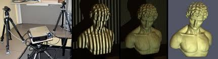
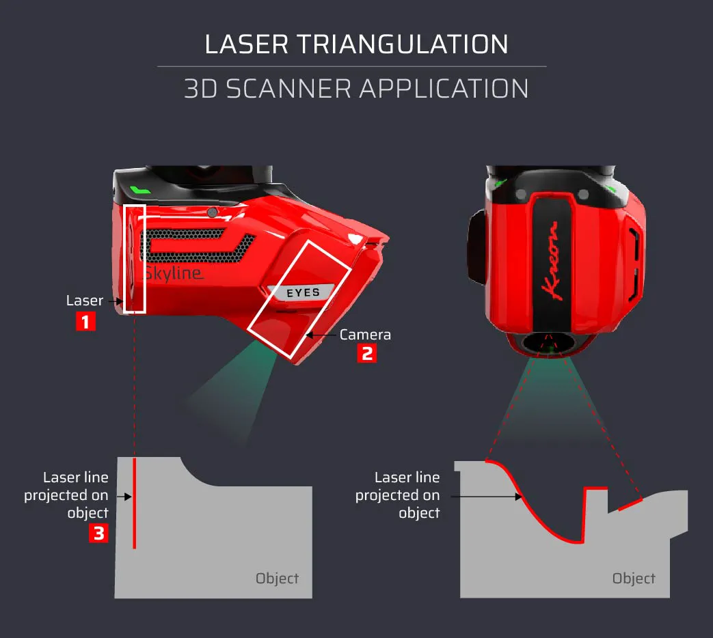
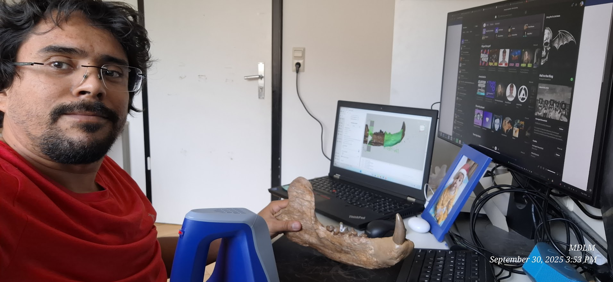
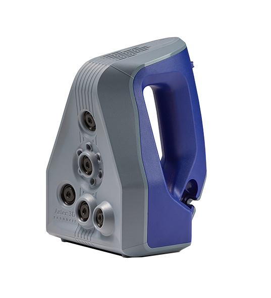
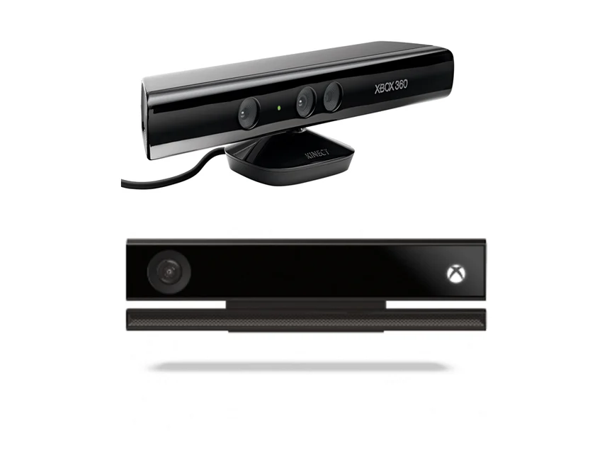

# Escaneo Láser de Superficie {background-color="#1E2B3A"}

## ¿Qué es el Escaneo de Superficie?

El escaneo 3D de superficie usa **luz activa** (láser o luz estructurada) para medir la geometría de un objeto de forma precisa y sin contacto físico.

::: {.columns}
::: {.column width="60%"}
A diferencia de la fotogrametría —que *infiere* la forma a partir de fotos—, el escáner **mide directamente** la posición 3D de cada punto.

::: incremental
- La escala real queda registrada automáticamente
- No requiere cámaras convencionales
- El resultado es una **nube de puntos** o una **malla** directa
:::
:::
::: {.column width="40%"}
{.img-shadow width="90%"}
:::
:::

---

## Tipos de Tecnología de Escaneo

::: {.columns}
::: {.column width="50%"}
### Triangulación Láser
- Proyecta un **haz de luz puntual o lineal**
- Mide la posición del reflejo con una cámara lateral
- Muy alta precisión (décimas de milímetro)
- Rango corto: ideal para **especímenes pequeños**
- 💰 Costo: \$2,000 – \$50,000 USD
:::
::: {.column width="50%"}
### Luz Estructurada
- Proyecta un **patrón de franjas** sobre el objeto
- ​Mide la **deformación** del patrón para calcular profundidad
- Velocidad muy alta, captura completa en segundos
- Sensible a la **luz ambiental intensa**
- 💰 Costo: \$5,000 – \$30,000 USD
:::
:::

---

### Ejemplos

::: {.columns}
::: {.column width="50%"}
#### Luz Estructurada
{.img-shadow width="95%"}
:::
::: {.column width="50%"}
#### Triangulación Láser
{.img-shadow width="95%"}
:::
:::

---

## Tipos de Tecnología de Escaneo (cont.)

::: {.columns}
::: {.column width="50%"}
### Time of Flight (ToF)
- Emite un pulso de luz y mide el **tiempo de retorno**
- Ideal para **objetos y espacios grandes** (hasta cientos de metros)
- Menor resolución que la triangulación
- Usado en LiDAR terrestre y escáneres de arquitectura
- 💰 Costo: \$10,000 – \$100,000+ USD
:::
::: {.column width="50%"}
### Fotogrametría vs. Escaneo
| Aspecto | Fotogrametría | Escaneo Láser |
|---|---|---|
| Escala real | ❌ No | ✅ Sí |
| Textura | ✅ Alta | ⚠️ Depende |
| Costo | ✅ Bajo | ❌ Alto |
| Velocidad | Medio | Rápido |
| Superficies oscuras | ✅ OK | ❌ Problema |
:::
:::

---

## Limitaciones del Escaneo Láser

::: {.columns}
::: {.column width="50%"}
### Limitaciones Físicas
::: incremental
- **Oclusión:** No captura lo que no "ve" — los huecos internos son invisibles
- **Superficies problemáticas:** Las negras, brillantes o translúcidas absorben o reflejan mal el láser
- **Solo exterior:** Incapaz de ver el interior de un fósil dentro de roca
- **Movimiento:** Cualquier movimiento durante el escaneo genera artefactos
:::
:::
::: {.column width="50%"}
### Limitaciones Prácticas
::: incremental
- **Dependencia de hardware:** Si el sensor falla, no hay captura alternativa
- **Condiciones ambientales:** La luz solar directa satura los sensores de luz estructurada y ToF
- **Tamaño del objeto:** Cada tecnología tiene un rango óptimo — un escáner de mano no es bueno para microfósiles
- **Curva de aprendizaje:** Software y parámetros técnicos requieren certificación o entrenamiento
:::
:::
:::

---

## Rangos de Costo

::: {.columns}
::: {.column width="33%"}
### 💚 Bajo Costo
**\$150 – \$800 USD**

- Microsoft Kinect (discontinuado)
- Intel RealSense D435
- Creality Raptor

Ideal para práctica académica. Precisión limitada (±1–5 mm).
:::
::: {.column width="33%"}
### 🟡 Gama Media
**\$2,000 – \$15,000 USD**

- Shining3D EinScan SP/HX
- Peel 3D
- Revopoint RANGE

Precisión buena (±0.1 mm). Usados en paleontología de campo.
:::
::: {.column width="33%"}
### 🔴 Gama Alta / Metrología
**\$30,000 – \$200,000+ USD**

- Artec Eva / Leo
- Creaform HandySCAN
- FARO Focus

Precisión de museo (±0.01 mm). Estándar en colecciones de referencia internacional.
:::
:::

---

## Software para Escaneo Láser

::: {.columns}
::: {.column width="50%"}
### Propietario (incluido con hardware)
- **Artec Studio** — Flujo completo para escáneres Artec
- **EinScan Software** — Para gama Shining3D
- **Peel Software** — Para escáneres Peel
:::
::: {.column width="50%"}
### Open Source / Gratuito
- **MeshLab** — Post-proceso universal de mallas
- **CloudCompare** — Análisis y comparación de nubes de puntos
- **RTAB-Map** — SLAM + reconstrucción (ideal con Kinect)
- **Open3D** — Librería Python para procesamiento avanzado
:::
:::

::: {.columns}
::: {.column width="50%"}
{.img-shadow width="95%"}
:::
::: {.column width="50%"}
{.img-shadow width="95%"}
:::
:::

::: {.callout-tip}
Para un entorno académico de bajo costo, la combinación **Kinect + RTAB-Map + MeshLab** ofrece resultados medianamente buenos para objetos grandes.
:::

# Caso Práctico: Microsoft Kinect {background-color="#1E2B3A"}

## ¿Qué es el Kinect?

El **Microsoft Kinect** nació en 2010 como accesorio de juego para Xbox 360, pero se convirtió en la puerta de entrada más accesible al escaneo 3D estructurado.

::: {.columns}
::: {.column width="60%"}
### Componentes internos
::: incremental
- **Cámara RGB** — Captura color (640×480 px en Kinect v1)
- **Proyector IR** — Emite un patrón de puntos infrarrojos invisible al ojo humano
- **Cámara IR** — Lee la deformación del patrón para calcular profundidad
- **Motor de inclinación** — Ajusta el ángulo verticalmente (solo Kinect v1)
- **Array de micrófonos** — No útil para escaneo, pero parte del hardware
:::
:::
::: {.column width="40%"}
{.img-shadow width="85%"}
:::
:::

---

## Características y Especificaciones

::: {.columns}
::: {.column width="50%"}
### Kinect v1 (Xbox 360)
| Especificación | Valor |
|---|---|
| Resolución profundidad | 640 × 480 px |
| Rango de trabajo | 0.5m – 3.5m |
| FPS | 30 fps |
| Campo de visión | 57° H × 43° V |
| Interfaz | USB 2.0* |
| Precio de segunda mano | ~\$100–\$500 MXN |
:::
::: {.column width="50%"}
### Kinect v2 (Xbox One)
| Especificación | Valor |
|---|---|
| Resolución profundidad | 512 × 424 px |
| Tecnología | Time of Flight |
| Rango de trabajo | 0.5m – 4.5m |
| FPS | 30 fps |
| Campo de visión | 70° H × 60° V |
| Interfaz | USB 3.0* |
:::
:::

---

## Limitaciones del Kinect para Paleontología

::: incremental
- **Resolución espacial:** Los fósiles pequeños (< 20 cm) quedan con muy poco detalle — el Kinect fue diseñado para capturar personas enteras
- **Ruido a distancia:** Más allá de 2.0m la nube de puntos se vuelve ruidosa e imprecisa
- **Luz solar directa:** El proyector IR queda saturado por la luz del sol — *solo funciona en interiores o sombra*
- **Superficies sin textura:** El patrón IR no ancla bien en superficies blancas lisas o monocromáticas
- **Hardware descontinuado:** Microsoft dejó de fabricar el Kinect en 2017, solo disponible de segunda mano o con adaptadores
- **Requiere adaptador:** El Kinect para Xbox necesita un kit de adaptador para conectarlo a PC vía USB
:::

---

## Software: RTAB-Map

**RTAB-Map** (Real-Time Appearance-Based Mapping) es el software de referencia para usar el Kinect como escáner 3D.

::: {.columns}
::: {.column width="50%"}
### ¿Qué hace?
- Implementa **SLAM** (Simultaneous Localization And Mapping)
- Registra cada fotograma de profundidad con el anterior
- Construye un mapa 3D en tiempo real
- Detecta cuando ya "conoce" una zona (cierre de bucle)
- Genera una malla 3D reconstruida al finalizar

### Disponible en
- Windows, Linux, macOS
- Gratuito y open source
:::
::: {.column width="50%"}
### Flujo básico en RTAB-Map

```
Abrir RTAB-Map
    ↓
Seleccionar: Kinect (libfreenect)
    ↓
[Start] — mueve lentamente el sensor
    ↓
[Stop] — cuando estés satisfecho
    ↓
Edit → Optimize Graph  (corrige deriva)
    ↓
File → Export 3D Clouds
    ↓
Exportar .OBJ o .PLY con textura
```
:::
:::

---

## Técnica de Escaneo con Kinect

::: {.columns}
::: {.column width="55%"}
### Antes de empezar
- Iluminar el espécimen con **luz difusa**, nunca luz solar directa
- El objeto debe tener **textura visible** — poner referencias visuales si es necesario (papel de puntos)
- Mantener el Kinect entre **0.5m y 2m** del objeto
- Ajustar la inclinación del motor antes de empezar

### Durante el escaneo
1. Pulsar **Start (▶)** — esperar puntos verdes (features)
2. Mover **muy lento** (~5 cm/segundo)
3. Solapar cada posición (mínimo **50% overlap**)
4. Hacer **círculos completos** alrededor del objeto
5. Si aparece rojo (tracking perdido): ⚠️ *volver a zona conocida*
:::
::: {.column width="45%"}
### Señales de calidad
| Indicador | Significado |
|---|---|
| 🟢 Barra verde | Tracking correcto |
| Inliers > 50 | Excelente |
| 🟡 Barra amarilla | Ir más despacio |
| 🔴 Pantalla roja | Tracking perdido |

### Parámetros clave (pre-configurados)
| Parámetro | Valor | Por qué |
|---|---|---|
| MaxDepth | 3.5m | Evita ruido de fondo |
| MinDepth | 0.5m | Zona ciega del Kinect |
| MaxFeatures | 1000 | Mejor tracking |
| Bundle Adjustment | ON | Corrige geometría |
:::
:::

---

## Post-proceso: De Nube de Puntos a Malla 3D

Una vez capturada la nube en RTAB-Map, necesitamos convertirla en una **malla cerrada** (watertight) apta para análisis.

::: {.columns}
::: {.column width="50%"}
### En RTAB-Map
1. **Edit → Optimize Graph** — corrige errores de trayectoria acumulados
2. **File → Export 3D Clouds** con estos ajustes:
   - Filtrado: Voxel size `0.005` (5mm máximo detalle)
   - Método: **Poisson** (Depth 8–10)
   - Activar *"Generate texture"* para color
3. Exportar en **.obj** (con textura) o **.ply** (nube pura)
:::
::: {.column width="50%"}
### Limpieza final en MeshLab
```
1. Filters → Cleaning →
      Remove Isolated pieces

2. Filters → Smoothing →
      Laplacian Smooth (2–3 iter.)

3. Filters → Reconstruction →
      Screened Poisson Surface
      (si la malla tiene agujeros)

4. File → Export Mesh As →
      .OBJ / .STL / .PLY
```
:::
:::

# Tomografía Computarizada (CT) {background-color="#1E2B3A"}

## ¿Qué es la Tomografía Computarizada?

La Tomografía Computarizada (CT, del inglés *Computed Tomography*) es el **estándar de oro** en paleontología virtual para el estudio de estructuras internas.

::: {.columns}
::: {.column width="60%"}
A diferencia del escaneo superficial, la CT usa **Rayos X** que **atraviesan** el objeto, revelando su interior sin dañarlo.

::: incremental
- Detectores registran cuánta radiación absorbió cada punto del material
- Una computadora reconstruye **rebanadas** (secciones transversales) del objeto
- El resultado es un **volumen 3D** completo, interior y exterior
- Se puede "ver dentro" del fósil sin extraerlo de la roca
:::
:::
::: {.column width="40%"}
{.img-shadow width="90%"}
:::
:::

---

## ¿Cómo funciona el CT?

::: {.columns}
::: {.column width="55%"}
### El principio físico
1. Una fuente de **Rayos X** gira alrededor del objeto
2. En cada ángulo, los detectores miden la **atenuación** de la radiación
3. El algoritmo de **retroproyección filtrada** reconstruye secciones 2D
4. Las secciones se apilan en un **volumen 3D** (stack de imágenes)

### El concepto de Vóxel
Un **vóxel** (volumetric pixel) es el equivalente 3D del píxel. Cada vóxel guarda un valor de **densidad** en escala de grises llamado **Unidades Hounsfield (HU)**:

| Material | HU aproximados |
|---|---|
| Aire | -1000 |
| Grasa | -100 a -50 |
| Agua | 0 |
| Hueso cortical | +400 a +1900 |
:::
::: {.column width="45%"}
### Archivos DICOM
- **DICOM** es el formato estándar médico
- Cada "rebanada" es una imagen DICOM
- Una serie típica tiene **400 – 2,000 imágenes**
- Cada imagen incluye metadatos: resolución, orientación, escala real
- Ventaja crucial: **la escala real está embebida en el archivo**

::: {.callout-note}
Un CT clínico tiene rebanadas de ~0.5mm. Un **Micro-CT** puede llegar a **1–10 micrómetros** — capaz de ver células individuales.
:::
:::
:::

---

## Tipos de Tomografía

::: {.columns}
::: {.column width="33%"}
### CT Clínico (Médico)
- Diseñado para el cuerpo humano
- Resolución: ~0.5 mm por vóxel
- Ideal para: vertebrados grandes, cráneos, fémures
- **Acceso:** Convenios con hospitales o clínicas
- **Costo:** Variable; a veces disponible con convenio universitario

**Ventaja:** Amplia disponibilidad geográfica
:::
::: {.column width="33%"}
### CT Industrial
- Diseñado para materiales y piezas de manufactura
- Resolución: 0.05 – 0.5 mm por vóxel
- Mayor rango de densidades detectables (metales)
- Ideal para: fósiles grandes, matrices de roca dura
- **Costo:** \$200 – \$1,000 USD por sesión

**Ventaja:** Soporta objetos muy densos
:::
::: {.column width="33%"}
### Micro-CT
- Diseñado para especímenes pequeños (< 10 cm)
- Resolución: **1 – 50 micrómetros** por vóxel
- Equipo de laboratorio especializado
- Ideal para: microfósiles, dientes, vértebras pequeñas
- **Costo equipo:** \$200,000 – \$1,000,000+ USD
- **Costo uso:** \$100 – \$500 USD/hora

**Ventaja:** Detalle sin igual
:::
:::

---

## Limitaciones de la Tomografía

::: {.columns}
::: {.column width="50%"}
### Limitaciones Técnicas
::: incremental
- **Contraste de densidad:** Si el hueso y la roca circundante tienen densidades similares, el software no puede separarlos (artefacto de "partial volume")
- **Metales:** Generan artefactos de haz endurecido (beam hardening) — zonas negras o blancas falsas
- **Tamaño vs. resolución:** A mayor espécimen, menor resolución posible
- **Tiempo de escaneo:** Un Micro-CT puede tardar 4–12 horas por muestra
:::
:::
::: {.column width="50%"}
### Limitaciones Prácticas
::: incremental
- **Costo prohibitivo:** El acceso a Micro-CT requiere laboratorio especializado
- **Nula portabilidad:** Los equipos pesan varias toneladas
- **Transporte del espécimen:** Requiere permisos y condiciones especiales de seguridad para fósiles frágiles
- **Formato propietario:** Aunque DICOM es estándar, cada fabricante añade campos que no siempre son compatibles
- **Radiación:** El uso repetido en el mismo espécimen puede alterar materiales orgánicos residuales
:::
:::
:::

---

## Acceso a la Tomografía: ¿Cómo llegar sin laboratorio propio?

::: {.columns}
::: {.column width="50%"}
### Vías de acceso reales
- **Hospitales públicos:** Algunos permiten escaneos en horarios valle con justificación de investigación
- **Universidades:** Muchas cuentan con Micro-CT en departamentos de biología o materiales
- **Servicios externos:** Empresas especializadas (efecto *"core facility"*) venden tiempo de uso
- **Datos existentes:** MorphoSource y Phenome10K distribuyen datos DICOM de fósiles ya escaneados
:::
::: {.column width="50%"}
### Repositorios de datos CT abiertos
| Recurso | Contenido |
|---|---|
| [MorphoSource](https://www.morphosource.org) | Fósiles y anatomía comparada |
| [Phenome10K](https://www.phenome10k.org) | CT de 10k+ especímenes |
| [DigiMorph](http://digimorph.org) | Visualizaciones interactivas |

::: {.callout-tip}
Para este curso usaremos datos de **MorphoSource** — gratuitos y de alta calidad.
:::
:::
:::

# Software para Procesamiento CT {background-color="#1E2B3A"}

## Panorama de Software para CT

El primer paso al recibir datos DICOM es convertir el **volumen** en una **malla 3D** utilizable. Esto se llama **segmentación**.

::: {.columns}
::: {.column width="50%"}
### Software Comercial
| Software | Uso típico | Costo |
|---|---|---|
| Avizo | Paleontología/medicina | ~\$10,000/año |
| MIMICS | Biomedicina | ~\$15,000/año |
| VGStudio MAX | Industrial | ~\$8,000/año |
| Dragonfly | Ciencias de materiales | ~\$5,000/año |

*Potentes pero fuera del alcance académico general.*
:::
::: {.column width="50%"}
### Software Gratuito / Open Source
| Software | Ventaja |
|---|---|
| **3D Slicer** | Más completo, activo, extensiones |
| ITK-SNAP | Sencillo, ideal para empezar |
| Fiji (ImageJ) | Análisis de imágenes 2D/3D |
| ParaView | Visualización científica avanzada |
| Seg3D | Segmentación científica CIBC |

::: {.callout-note}
Para este curso usaremos **3D Slicer** — es gratuito, multiplataforma y es el estándar de facto en investigación.
:::
:::
:::

---

## Ejemplo Práctico: 3D Slicer

**3D Slicer** es una plataforma open source de código libre para visualización médica e investigación. Desarrollada activamente desde 1998 (Brigham and Women's Hospital / MIT).

::: {.columns}
::: {.column width="55%"}
### ¿Qué puede hacer?
::: incremental
- Cargar series DICOM completas (cientos de imágenes)
- Visualizar el volumen en los tres planos (axial, coronal, sagital) y en 3D
- **Segmentar** estructuras por densidad, color o dibujado manual
- Generar modelos 3D de superficies (mallas)
- Exportar a **STL**, **OBJ**, **PLY** para análisis o impresión 3D
- Medir distancias, ángulos y volúmenes directamente en el volumen
:::
:::
::: {.column width="45%"}
### Extensiones relevantes
- **SegmentEditorExtra** — herramientas avanzadas de segmentación
- **SlicerMorph** — morfometría geométrica 3D
- **Endocast** — extracción de endocraneos digitales
- **BoneTexture** — análisis de microestructura ósea

::: {.callout-tip}
SlicerMorph fue desarrollado específicamente para paleontología y biología evolutiva.
:::
:::
:::

---

## Flujo de Trabajo en 3D Slicer

::: {.columns}
::: {.column width="50%"}
### Paso 1: Cargar datos
```
Menú → File → Add DICOM Data
    → Import DICOM files
    → Seleccionar carpeta con imágenes
    → Load
```

### Paso 2: Explorar el volumen
- Vista axial, coronal y sagital simultáneas
- Ajustar **Window/Level** para ver mejor los huesos
- Usar scroll para navegar entre rebanadas
:::
::: {.column width="50%"}
### Paso 3: Segmentar
```
Módulo → Segment Editor
    → Add (+) — crear nuevo segmento
    → Threshold — definir rango de HU del hueso
    → Islands → Keep largest island
    → Scissors → recortar artefactos
    → Smoothing → suavizar el resultado
```

### Paso 4: Exportar el modelo 3D
```
Módulo → Segmentations
    → Export/Import Models and Tables
    → Output: Models
    → Formato: OBJ / STL
```
:::
:::

---

## La Técnica de Umbralización (Thresholding)

El principio fundamental de la segmentación digital de fósiles es el **umbral de densidad**:

::: {.columns}
::: {.column width="55%"}
### ¿Cómo funciona?
1. Cada vóxel tiene un valor de densidad (HU)
2. Definimos un **umbral mínimo y máximo** — por ejemplo: 400 a 1900 HU para hueso cortical
3. El software **colorea** todos los vóxeles dentro de ese rango
4. El resultado es la selección visual del hueso separado de la roca

### El Problema del Contraste
Si el fósil tiene densidad similar a la matriz rocosa, los umbrales se superponen y es necesario segmentar **manualmente** con las herramientas de pincel (Paint) o tijeras (Scissors).
:::
::: {.column width="45%"}
### Herramientas de Segment Editor
| Herramienta | Uso |
|---|---|
| **Threshold** | Selección automática por HU |
| **Paint** | Pincel manual en 2D/3D |
| **Erase** | Borrar partes de la selección |
| **Draw** | Contorno manual en una rebanada |
| **Scissors** | Recortar una región entera |
| **Grow from Seeds** | Relleno automático desde semillas |
| **Islands** | Eliminar fragmentos sueltos |
| **Smoothing** | Suavizar la superficie final |
:::
:::

# Recursos y Conclusiones {background-color="#1E2B3A"}

## Herramientas y Recursos

::: {.columns}
::: {.column width="50%"}
### 🔧 Software (Gratuito)
- [RTAB-Map](https://introlab.github.io/rtabmap/) — Escaneo con Kinect
- [MeshLab](https://www.meshlab.net/) — Post-proceso de mallas
- [CloudCompare](https://www.cloudcompare.org/) — Análisis de nubes de puntos
- [3D Slicer](https://www.slicer.org/) — Segmentación CT
- [Blender](https://www.blender.org/) — Edición y reescalado

### 📐 Addon de Blender
- [Measure and Scale](https://extensions.blender.org/add-ons/measure-and-scale/) — Escalado de modelos fotogramétricos
:::
::: {.column width="50%"}
### 🌐 Repositorios de Modelos 3D
- [MorphoSource](https://www.morphosource.org/) — CT y fotogrametría de especímenes
- [Sketchfab](https://sketchfab.com/) — Visualización interactiva
- [Phenome10K](https://www.phenome10k.org/) — CT de 10,000+ especímenes
- [DigiMorph](http://digimorph.org/) — Biblioteca CT con visualización

:::
:::

---

## Conclusiones del Día 3

::: {.columns}
::: {.column width="50%"}
### Escaneo Láser
- Mide la **geometría directamente** — escala real incluida
- Ideal para superficies **externas** medianas o grandes
- El **Kinect** democratiza el acceso (~\$50 USD de segunda mano)
- Limitado por superficies oscuras/brillantes y ausencia de interior
:::
::: {.column width="50%"}
### Tomografía Computarizada
- Única tecnología que revela el **interior** del fósil sin dañarlo
- Resultados en formato **DICOM** con escala real embebida
- **3D Slicer** es la herramienta estándar gratuita para segmentación
- El acceso se puede gestionar a través de repositorios abiertos
:::
:::

---

::: {.columns}
::: {.column width="60%"}
### Mapa de decisión: ¿Qué técnica usar?

```
¿Necesitas ver el interior?
    SÍ → CT Scan + 3D Slicer
    NO → ¿Tienes presupuesto?
            ALTO → Escáner láser profesional
            BAJO → ¿Es el espécimen < 5cm?
                    SÍ → Fotogrametría
                    NO → Kinect + RTAB-Map
```
:::
::: {.column width="40%"}
::: {.callout-note}
### Siguiente Paso
**Práctica guiada:** Segmentación de un fósil en 3D Slicer usando datos de MorphoSource.

Descargar datos DICOM previo a la clase.
:::
:::
:::
