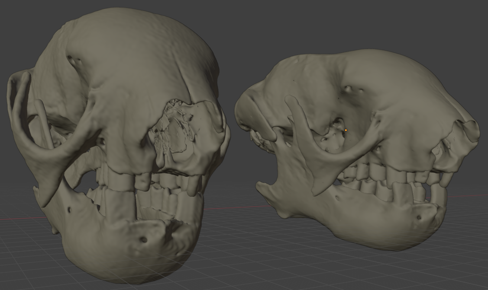
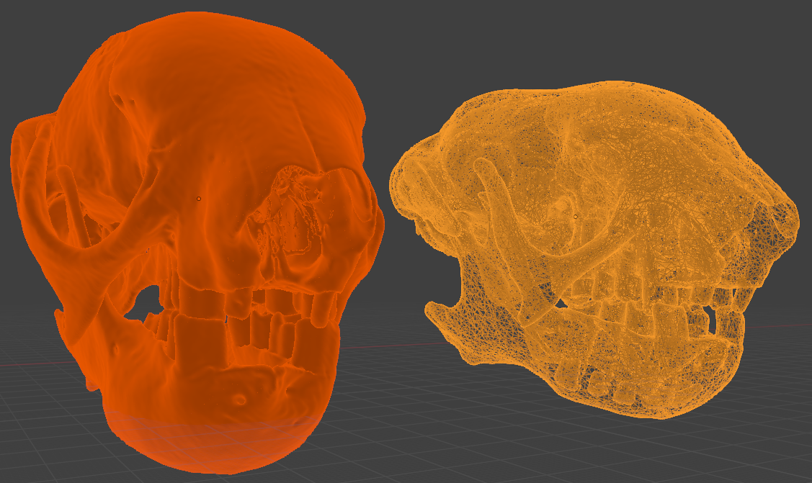
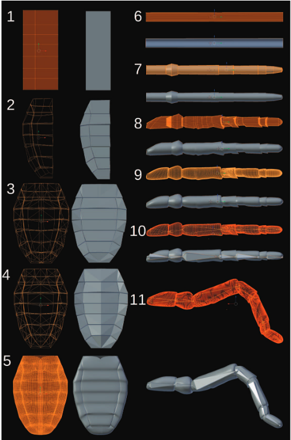
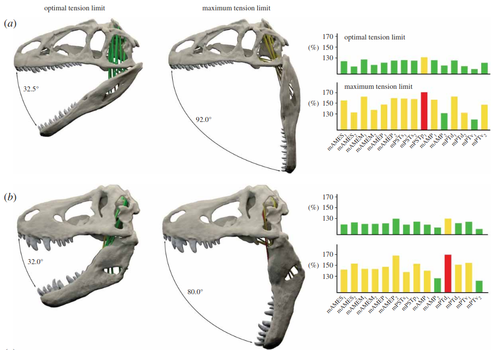
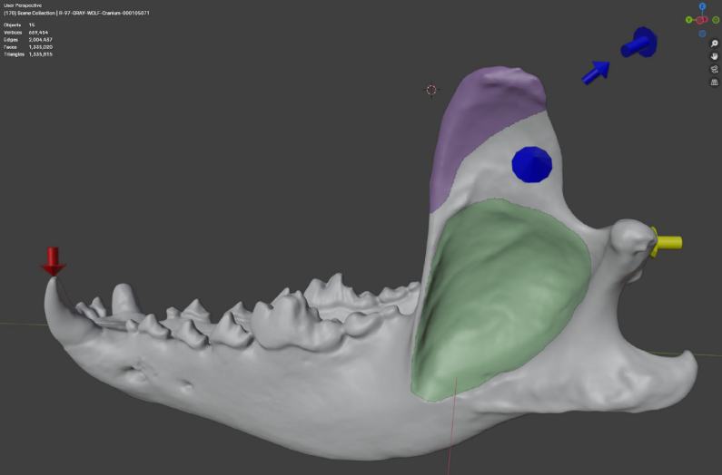

# Introducción a Blender {background-color="#1E2B3A"}

## ¿Qué es Blender?

**Blender** es una suite de creación 3D de código abierto, gratuita y multiplataforma, mantenida por The Blender Foundation.

::: {.columns}
::: {.column width="60%"}
Lanzado bajo una licencia GNU (General Public License), cubre la totalidad del pipeline 3D. 

::: incremental
- **Modelado y escultura:** Creación y modificación de mallas detalladas
- **Animación y rigging:** Simulación de movimiento mediante "huesos"
- **Renderizado:** Trazado de rayos avanzado
- **Edición y composición:** Postproducción incorporada
:::
:::
::: {.column width="40%"}
{.img-shadow width="70%"}
:::
:::

---

## Propiedades y Ventajas

::: {.columns}
::: {.column width="50%"}
### Ventajas principales
::: incremental
- **Alternativa a software comercial:** A pesar de ser gratuita, sus capacidades rivalizan con programas costosos de alta gama como Maya o 3ds Max [@Garwood2014].
- **Versatilidad de formatos:** Permite importar y exportar desde .OBJ, .STL, .PLY hasta formatos industriales.
- **Renderizado realista (Raytracing):** Simula el comportamiento físico de la luz para imágenes y videos de calidad para publicación.
- **Comunidad global:** Actualizaciones gratuitas y continuas con un vasto ecosistema de tutoriales.
:::
:::
::: {.column width="50%"}
### Limitaciones a considerar
::: incremental
- **Curva de aprendizaje:** Interfaz gráfica compleja para nuevos usuarios frente a software más específico. El artículo proporciona una **guía paso a paso** (material suplementario) para mitigar esta dificultad [@Garwood2014].
- **Rendimiento con mallas crudas:** Mallas enormes (como las obtenidas directamente de un CT scan o fotogrametría densa sin limpiar) pueden ralentizar considerablemente la aplicación.
- **No es software analítico:** Permite simulación física y visual, pero **no** es un paquete para análisis biomecánico.
:::
:::
:::

---

## Uso de Extensiones (Add-ons) y Python

Blender se destaca por su gran capacidad de personalización y automatización.

::: {.columns}
::: {.column width="55%"}
### Integración con Python
::: incremental
- El núcleo de Blender incorpora una consola interactiva de **Python 3**.
- **Todo** lo que se hace gráficamente en Blender se puede ejecutar mediante scripts programados (`import bpy`).
- Automatiza el procesamiento por lotes (ej. reescalar, simplificar e iluminar cientos de mallas a la vez).
- Facilita la interoperabilidad al usar bibliotecas científicas de Python en conjunto con el entorno visual.
:::
:::
::: {.column width="45%"}
### Extensiones (Add-ons)
::: incremental
- El uso de extensiones expande nativamente las funciones de Blender.
- *Ejemplo en Paleontología:* Add-ons como **Measure and Scale** ayudan a dar dimensiones métricas a fotogrametría suelta.
- Add-ons de impresión 3D (*3D Print Toolbox*) detectan rápidamente voladizos o mallas no cerradas ("non-manifold").
:::
:::
:::

# Limpieza y Reparación de Mallas {background-color="#1E2B3A"}

## Optimización de Modelos Escaneados

Las mallas resultantes de Fotogrametría o CT suelen contener errores, ruido estadístico y millones de polígonos innecesarios.

::: {.columns}
::: {.column width="50%"}
### Problemas comunes
::: incremental
- **Geometría defectuosa:** Polígonos superpuestos, normales invertidas, bordes abiertos.
- **Sobre-densidad (Exceso de polígonos):** Partes planas que tienen miles de vértices sin aportar detalle al relieve.
- **Artefactos "flotantes":** Restos de la matriz, roca, o puntos perdidos en escaneos láser.
:::
:::
::: {.column width="50%"}
### Flujo de optimización
1. **Importación y escalado**
2. **Selección y limpieza manual:** Borrar partes flotantes.
3. **Reparación topológica:** Unir vértices y recalcular normales (`Shift + N`).
4. **Reducción de Polígonos (Decimation):** Simplificar donde sea posible.
:::
:::

---

## Reducción de Polígonos (Decimate)

El modificador **Decimate** en Blender nos permite reducir drásticamente el peso de un Fósil "crudo" sin perder su morfología aparente.

::: {.columns}
::: {.column width="60%"}
### Métodos de Reducción
::: incremental
- **Colapso (Collapse):** Fusiona vértices progresivamente según un ratio. Mantiene la forma general y las áreas con bordes duros.
- **Desubdividir (Un-Subdivide):** Intenta simplificar topologías de mallas con un patrón base de grilla regular.
- **Planar:** Elimina vértices en superficies planas definiendo un ángulo límite, excelente para preservar bordes cortantes de dientes o garras.
:::

::: {.callout-tip}
Un modelo de 5 millones de caras puede reducirse a 300,000 caras sin perder detalle visual, agilizando su carga en plataformas web como Sketchfab.
:::
:::
::: {.column width="40%"}
### Antes y Después
{.img-shadow width="45%"}
{.img-shadow width="45%"}
*(Representación de una reducción poligonal)*
:::
:::

# Escultura Digital {background-color="#1E2B3A"}

## Herramientas de Escultura en Blender

El modo **Sculpt** de Blender permite interactuar con mallas 3D como si fueran arcilla digital.

::: {.columns}
::: {.column width="50%"}
### Pinceles clave en Paleo
::: incremental
- **Smooth:** Esencial para borrar los escalones de las rebanadas en modelos exportados desde software de CT.
- **Grab / Elastic Deform:** Para retrodeformación manual o reposicionamiento.
- **Flatten / Scrape:** Para eliminar excrecencias de sedimentos virtuales unidos al hueso reconstruido.
- **Clay Strips:** Usado a menudo para recrear volumen en partes perdidas de un espécimen o simular tejidos musculares.
:::
:::

::: {.column width="50%"}
### Dyntopo (Topología Dinámica)
::: incremental
- Mientras se esculpe, triangula *automáticamente* y añade polígonos sólo bajo el trazo del pincel.
- Ideal para esculpir restauraciones desde cero o fusionar fracturas virtuales de modo orgánico.
:::
:::
:::

# Blender en la Paleontología {background-color="#1E2B3A"}

## Casos de Uso y Aplicaciones Directas

Blender se ha convertido en el eje central del flujo de trabajo de la paleontología virtual, ya sea como paso final o como base principal para simulaciones biomecánicas.

### Áreas de uso documentado
::: incremental
- **Reposicionamiento y Restauración:** Reposicionamiento manual de elementos desarticulados (ej. re-articulación craneal) o remallado de elementos problemáticos.
- **Pre-procesamiento Biomecánico:** Delimitación de músculos. Creación de regiones musculares en huesos para simulaciones de Elementos Finitos (FEA) [@diazdeleon-munozBFEXToolboxFinite2025].
- **Animaciones Científicas:** Difusión visual (videos, animaciones), reconstrucción de movimientos [@Garwood2014].
:::

---

## Caso de Estudio 1: Locomoción en Arácnidos Fósiles

**Paper:** _The Walking Dead: Blender as a Tool for Paleontologists_ [@Garwood2014].

::: {.columns}
::: {.column width="60%"}
### El Desafío y Flujo
- Recrear el paso (*gait*) de *Palaeocharinus* (Rhynie Chert, Escocia).
- **Modelado:** Reconstrucción basada en un pariente fósil tridimensional (*Anthracomartus hindi*).
- **Animación (Rigging):** Creación de un esqueleto digital con restricciones anatómicas reales y aplicación de cinemática inversa (IK).
- **Resultado biomecánico:** Demostración de una locomoción muy similar a arañas cursoriales modernas, aunque carente en especies derivadas.
:::

::: {.column width="40%"}
{.img-shadow width="100%"}
:::
:::

---

## Caso de Estudio 2: Apertura Mandibular (Maximum Gape)

**Paper:** _Estimating cranial musculoskeletal constraints in theropod dinosaurs_ [@Lautenschlager2015].

::: {.columns}
::: {.column width="60%"}
### Biomecánica en Terópodos
- Blender sirvió como plataforma para estimar los límites funcionales de estiramiento muscular.
- Se modelaron los músculos aductores de la mandíbula craneal como cilindros 3D interactivoevolutivas s.
- **Validación biológica:** Rango de elongación del músculo restringido entre 130% y 170% de su longitud de reposo.
- **Resultado:** Depredadores como *T. rex* lograban aperturas funcionales mayores (hasta 80°) frente a taxones herbívoros afines como *Erlikosaurus* (aprox. 45°).
:::

::: {.column width="40%"}
{.img-shadow width="100%"}
:::
:::

---

## Herramientas: Reconstrucción Muscular (MyoGenerator)

::: {.columns}
::: {.column width="60%"}
### Reconstrucción Interactiva en 3D
**Paper:** _A toolbox for the retrodeformation and muscle reconstruction of fossil specimens in Blender_ [@Herbst2022]

- **Propósito:** Reconstrucción interactiva de la morfología muscular sobre modelos fósiles.
- **Flujo:** El usuario "pinta" las áreas de origen e inserción directamente sobre la malla.
- **Automatización:** Genera automáticamente volúmenes musculares 3D ajustables.
- **Métricas:** Calcula automáticamente volumen, longitud y centroides de unión, datos clave para estimar la fuerza muscular absoluta.
:::

::: {.column width="40%"}
{.img-shadow width="100%"}
:::
:::

---

## Caso de Estudio 3: Análisis de Elementos Finitos (BFEX)

**Paper:** _BFEX: A Toolbox for Finite Element Analysis With Fossils and Blender_ [@diazdeleon-munozBFEXToolboxFinite2025].

::: {.columns}
::: {.column width="60%"}
### De Blender a la Ingeniería (FEA)
- **Concepto:** Add-on puente que conecta el entorno de diseño creativo con el software de cálculo científico (*Fossils*).
- **Interfaz Gráfica:** Permite delimitar visualmente escenarios biomecánicos (músculos, puntos focales, magnitudes de carga).
- **Escalabilidad:** Define las propiedades del material (Módulo de Young, Poisson) sin necesidad de programar scripts complejos.
- **Eficiencia:** Agiliza el flujo de trabajo de simulación de estrés y deformación ósea en especímenes fósiles.
:::

::: {.column width="40%"}
{.img-shadow width="100%"}
:::
:::

---

## Conclusiones del Día 4

::: {.columns}
::: {.column width="50%"}
### Optimización
- Nunca asumamos que la malla "bruta" del escáner o fotogrametría está lista para usar.
- Debemos limpiar flotantes, reparar topología, y aplicar **Decimate** inteligentemente para un equilibrio entre detalle y optimización.
:::

::: {.column width="50%"}
### Potencia de Blender
- Su integración con Python y el sistema Add-on automatizan tareas titánicas en las colecciones.
- El uso de Rigging y constraints aporta herramientas biomecánicas reales, más allá de lo meramente estético, como se demostró en reconstrucciones analíticas.
:::
:::

::: {.callout-note}
### Siguiente Paso
**Práctica guiada:** Importación de un hueso escaneado en clase usando Blender, reducción poligonal, y aplicación de pinceles para eliminar ruido derivado del CT.
:::

---

## Enlaces de Utilidad y Herramientas

### Software del curso:

- [Blender](https://www.blender.org/) (Edición de mallas)

- [Blender Measure and Scale](https://extensions.blender.org/add-ons/measure-and-scale/) (Add-on de escalado real)

- [BFEX: Blender Finite Elements eXporter](https://github.com/MiguelDLM/BFEX) (Add-on para análisis de elementos finitos)

- [MyoGenerator](https://github.com/evaherbst/MyoGenerator) (Add-on original para reconstrucción muscular)

- [MyoGeneratorRemix](https://github.com/MiguelDLM/MyoGeneratorRemix) (Add-on mejorado para reconstrucción muscular)

- [Measure and Scale](https://github.com/MiguelDLM/Measure-and-Scale) (Add-on para escalado)

# Artículos de interés

:::{#refs}

:::