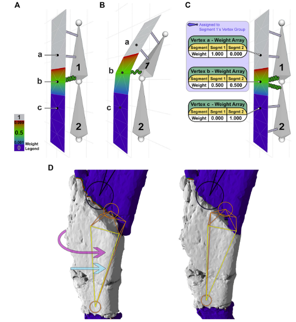
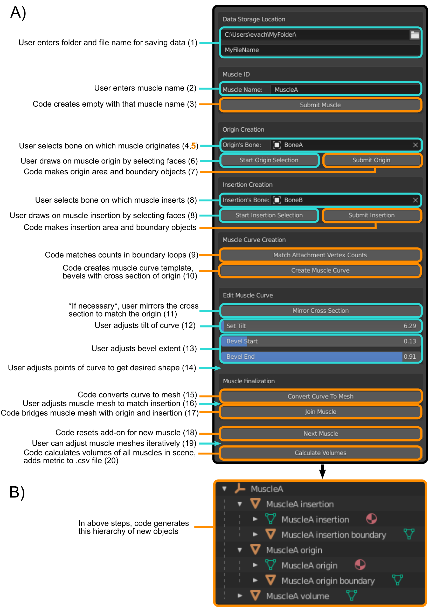
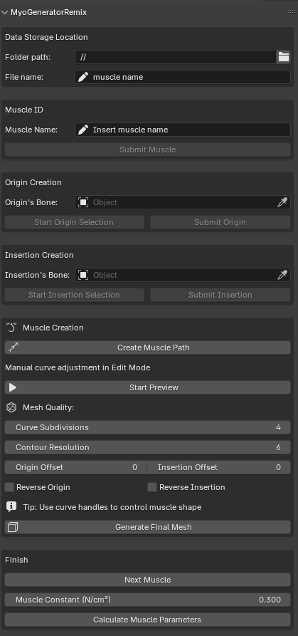
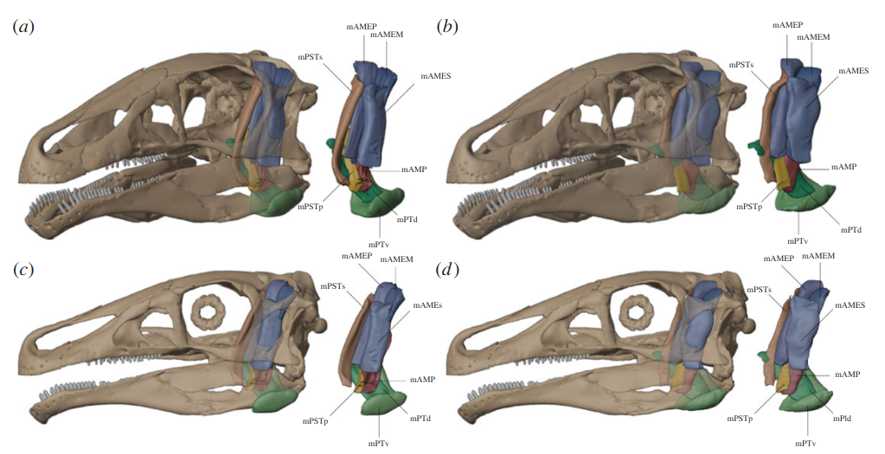

## Introducción a la Reconstrucción Muscular

::: {.columns}
::: {.column width="60%"}
### ¿Por qué reconstruir músculos?
- Los huesos solo cuentan una parte de la historia.
- La musculatura define la **función biológica**:
  - Locomoción.
  - Alimentación (fuerza de mordida).
  - Postura.
- Es el puente necesario para simulaciones de:
  - **FEA:** Para aplicar cargas realistas.
  - **Multibody Dynamics:** Para simular movimiento.
:::

::: {.column width="40%"}

:::
:::

---

## El Primer Paso: Retrodeformación

::: {.columns}
::: {.column width="60%"}
### Restauración antes del modelado
- Los fósiles suelen estar deformados (tafonomía).
- Antes de "poner músculos", debemos restaurar el hueso a su estado *in vivo*.
- **Técnicas en Blender [@Herbst2022; @DeVries2022]:**
  - **Mirroring:** Reflejar partes simétricas.
  - **Armatures (Rigging):** Para re-posicionar fragmentos.
  - **Remeshing:** Crear mallas base limpias y "watertight".
  - **Sculpt mode:** Reparar grietas y erosión superficial.
:::

::: {.column width="40%"}

:::
:::

---

## MyoGenerator y su sucesor

::: {.columns}
::: {.column width="60%"}
### Un enfoque interactivo y moderno
- **Original [@Herbst2022]:** Revolucionó el modelado 3D de músculos (reducción de 15h a 2h).
- **MyoGeneratorRemix:** Una evolución desarrollada para solucionar el abandono del código original y modernizar el flujo de trabajo.
- **Compatibilidad:** Optimizado para **Blender 4.2.0 - 4.4.x** (soporte total para versiones modernas).
- **Ventajas del Remix:**
  - Estabilidad de malla mejorada.
  - Cálculos biomecánicos autorregenerables.
  - Integración nativa de métricas de fuerza.
:::

::: {.column width="40%"}

:::
:::

---

## MyoGeneratorRemix: Innovaciones Técnicas

::: {.columns}
::: {.column width="60%"}
### Estabilidad y Robustez Geométrica
- **Parallel Transport Frames (Bishop Frames):**
  - Soluciona el problema de "torcedura" (*twisting*) de las mallas en curvas complejas.
  - Asegura que la orientación de la sección transversal sea consistente matemáticamente.
- **Lofting Dinámico:**
  - La malla se actualiza en **tiempo real** mientras se edita la curva Bezier o los manejadores.
- **Shaders Procedurales:**
  - Generación automática de materiales realistas (apariencia de tejido muscular y tendones) mediante *Geometry Nodes*.
:::

::: {.column width="40%"}

:::
:::

---

## MyoGeneratorRemix: Ventajas Biomecánicas

::: {.columns}
::: {.column width="60%"}
### Precisión en la Toma de Datos
- **Automatización de Métricas:**
  - Exportación de **Volumen**, **Longitud de Fibra real** y **PCSA** en un solo paso.
- **Integración de Fuerza ($F_m$):**
  - Aplica automáticamente el valor de estrés isométrico ($0.3\,N/mm^2$) en la exportación CSV.
- **Formatos de Análisis:**
  - CSV optimizado para lectura directa en herramientas de FEA (como **BFEX**) o Dinámica Multicuerpo.
:::
:::

---

## Prerrequisitos (Entorno Remix)

### Antes de ejecutar el add-on:
1. **Blender 4.2+:** Asegurar que estás en una versión moderna para soporte de Python 3.11+.
2. **Limpieza de Malla:** Huesos deben ser "manifold" y preferiblemente con topología uniforme.
3. **Escala y Rotación:** ¡Crítico! `Ctrl+A` > All Transforms.
4. **Normales:** Orientadas correctamente hacia fuera.
5. **Colecciones:** Mantener una estructura limpia (el add-on creará su propia colección de resultados).

---

## Conceptos Biomecánicos Clave

### Métricas que extraemos de los modelos:

1. **Volumen Muscular ($V_m$):** Calculado directamente desde la malla 3D.
2. **PCSA (Physiological Cross-Sectional Area):**
   - El área transversal que realmente genera fuerza.
   - **Fórmula:** $PCSA = \frac{V_m \cdot \cos(\theta)}{L_f}$
   - **Supuesto de Simplicidad:** Para modelos en los que no se conoce la arquitectura interna, se asume un **músculo de fibras paralelas** ($\theta = 0^\circ$) y que la **longitud de la fibra es igual a la longitud muscular** ($L_f = L_m$), simplificando a $PCSA = \frac{V_m}{L_m}$.

3. **Líneas de Acción:** La trayectoria del vector de fuerza.
4. **Brazo de Momento:** Eficiencia de la palanca muscular según su inserción.

---

## Estimación de Fuerza y Sensibilidad

### Del modelo a la fuerza mecánica
- **Cálculo de Fuerza ($F_m$):** Multiplicamos el PCSA por un valor de **estrés muscular isométrico**.
  - Se utiliza un valor estándar de **0.3 N/mm²** [@thomasonCranialMechanicsMarsupial1991; @wroeBiteClubComparative2005].
- **Análisis de Sensibilidad:**
  - Al mantener constantes el ángulo de penación ($\theta$) y la relación $L_f/L_m$, podemos aislar e investigar el efecto de:
    - **Volúmenes 3D** complejos.
    - Trayectorias de longitud **curvas vs. rectas**.
- **Resultado Clave:** Variar estos parámetros cambiaría la fuerza absoluta, pero **no la diferencia relativa** entre los métodos de reconstrucción testeados [@Herbst2022].

---

## Flujo de Trabajo: MyoGenerator (I)

### 1. Definición de áreas de anclaje (attachment areas)
- El add-on entra automáticamente en **Edit Mode**.
- **Selección de Caras:** Se seleccionan las caras del hueso donde se ancla el músculo.
  - Se recomienda usar la herramienta **Lasso Select**.
  - El área debe ser continua (sin huecos).
  - **Al enviar:** MyoGenerator crea:
  - Un objeto `[Nombre] origin/insertion` con las caras duplicadas.
  - Un objeto `[Nombre] boundary loop` con el contorno de la inserción.
  - Los organiza bajo un *Empty* para mantener jerarquía.

---

## Flujo de Trabajo: MyoGenerator (II)

### 2. Generación de la Trayectoria
- Se crea una **NURBS Curve** entre los centroides de origen e inserción.
- **Perfil (Bevel):** El add-on proyecta el loop de origen al plano XY para usarlo como sección transversal.
- **Ajustes manuales necesarios:**
  - **Mirroring:** A veces es necesario reflejar la sección transversal si la proyección se invirtió.
  - **Tilt:** Ajustar la torsión para alinear el perfil con el hueso.
  - **Bevel Extent:** Escalar para que el final de la curva coincida con la inserción.
- **Regla:** Se pueden mover los puntos intermedios (5 totales), pero **nunca los extremos**.

---

## Flujo de Trabajo: MyoGenerator (III)

### 3. Finalización
- **Join Muscle:** El add-on une el volumen de la curva con los loops de origen/inserción, realiza un "bridge" de aristas y cierra los extremos.
- **Ajuste de Secciones:** Al estar basado en *edge loops*, se puede usar **Proportional Editing** para ensanchar el vientre muscular.
- **Manejo de Inserciones Planas:**
  - Si el músculo es muy paralelo al hueso y no se alinea bien, se ensancha el final hasta que interseca el hueso.
  - Se aplica un modificador **Boolean Difference** (manual) para recortar el sobrante contra el hueso.
- **Limpieza:** Eliminar T-junctions y recalcular normales.

---

## Caso de Estudio: *Erlikosaurus andrewsi*

::: {.columns}
::: {.column width="60%"}
### Validación del método [@Herbst2022; @Lautenschlager2015]
- Reconstrucción de la musculatura mandibular de este terizinosaurio.
- **Comparativa:** 
  - MyoGenerator vs Segmentación manual de CT.
  - MyoGenerator vs Modelos de cilindros (Frustums).
- **Resultado:** MyoGenerator produjo volúmenes comparables a la segmentación de CT pero en una fracción del tiempo.
- Demostró mayor realismo que los cilindros simples al considerar la curvatura anatómica.
:::

::: {.column width="40%"}

:::
:::

---

## Integración con el Análisis Biomecánico

### Del modelo a los datos
- **Exportación CSV:** MyoGenerator exporta automáticamente:
  - Áreas de Origen/Inserción ($mm^2$).
  - Centroides de Origen/Inserción.
  - **Linear Length:** Distancia euclidiana entre centroides.
  - **Muscle Length:** Longitud real de la trayectoria curva.
  - Volumen Muscular ($mm^3$).
- **Uso posterior:**
  - **BFEX:** Exportar estas regiones a Fossils para análisis FEA [@diazdeleon-munozBFEXToolboxFinite2025].
  - **OpenSim:** Datos de entrada para dinámica multicuerpo.

---

## Estimación de Biomasa

::: {.columns}
::: {.column width="60%"}
### De los músculos al animal completo
- El volumen muscular nos da el **PCSA**, y por tanto la fuerza máxima.
- A partir del volumen de los principales grupos musculares y su densidad estimamos la **masa muscular**.
- **Contexto:** No confundir con la biomasa total del organismo (que usa convex hulls o lofting del esqueleto completo), sino que nos enfocamos en el **componente motor** del animal.
:::
:::

---

## Práctica Guiada

### En esta sesión:
1. Instalaremos el add-on **MyoGeneratorRemix**.
2. Pintaremos orígenes e inserciones en un cráneo.
3. Generaremos el volumen de los músculos aductores.
4. Exportaremos los datos biomecánicos a CSV.

---

## Enlaces de utilidad

- [MyoGeneratorRemix](https://github.com/MiguelDLM/MyoGeneratorRemix)
- [MyoGenerator](https://github.com/evaherbst/MyoGenerator)
- [Blender](https://www.blender.org/download/)

--- 

## Bibliografía

::: {#refs}
:::
