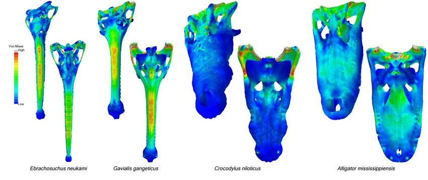
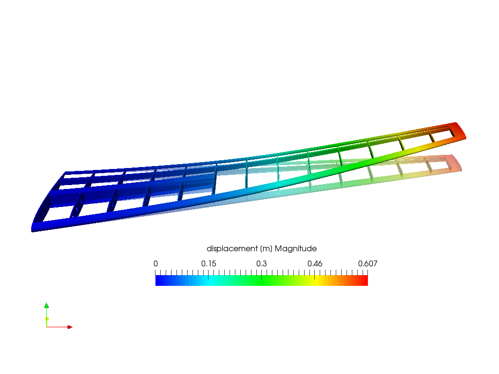
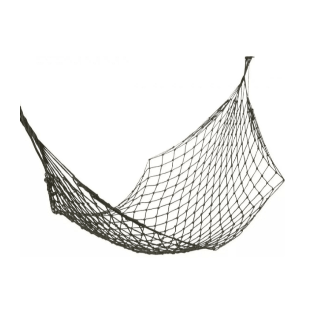
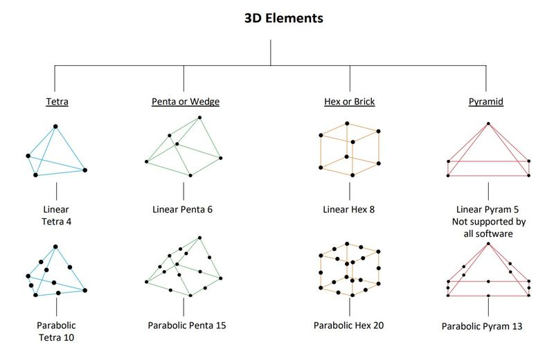
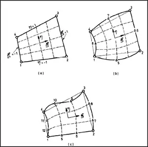
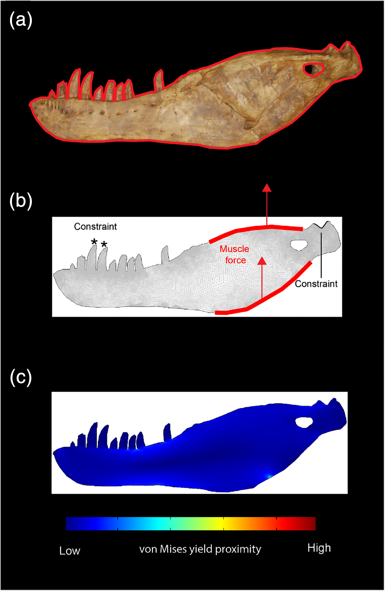

# Fundamentos del FEA {background-color="#1E2B3A"}

## ¿Qué es el Análisis de Elementos Finitos (FEA)?

::: {.columns}
::: {.column width="60%"}
### Simulando la física de lo extinto
::: incremental
- El **FEA** es un método computacional para predecir cómo un objeto responde a fuerzas físicas [@brightReviewPaleontologicalFinite2014].
- **Esfuerzo (Stress):** Fuerza interna que las partículas de un material ejercen entre sí.
- **Deformación (Strain):** Cambio en la forma del material debido al esfuerzo.
- **En Paleontología:** Permite testear hipótesis sobre dieta, fuerza de mordida y resistencia mecánica de huesos fósiles.
:::
:::
::: {.column width="40%"}
{width="100%"}
:::
:::

---

## El FEA nació en la ingeniería, llegó a los fósiles

::: {.columns}
::: {.column width="55%"}
### De aviones a dinosaurios
::: incremental
- **1940s–1950s:** Desarrollado para análisis estructural en ingeniería aeroespacial y civil.
- **Turner, Clough, Martin & Topp (1956):** Primera aplicación formal — análisis de esfuerzos en alas de avión.
- **Clough (1960):** Acuñó el término *"finite elements"*.
- **Paleontología:** Rayfield et al. (2001) — primer análisis en cráneo fósil (*Allosaurus fragilis*).
- **Hoy:** Herramienta estándar para estimar fuerza de mordida, resistencia ósea y modos de locomoción.
:::
:::
::: {.column width="45%"}
::: {.r-stack}
{.fragment width="100%"}

{.fragment width="100%"}
:::
:::
:::

---

## Cómo funciona: la analogía de la hamaca

::: {.columns}
::: {.column width="55%"}
::: incremental
- Resolver la física de un sólido continuo de forma exacta es matemáticamente inabordable.
- **Solución:** Dividir el objeto en miles de pequeños elementos simples (**discretización**).
- Cada elemento sigue las leyes de elasticidad de forma local.
- La suma de todos los elementos reproduce el comportamiento global del sólido.
- La **malla** es esa red: cuanto más fina, más fiel la simulación.
:::
:::
::: {.column width="45%"}
{width="90%"}
:::
:::

---

## Nodos, elementos y malla

::: {.columns}
::: {.column width="50%"}
### Anatomía de un modelo FEA
::: incremental
- **Nodo:** Punto de conexión entre elementos; almacena los resultados (desplazamiento, esfuerzo).
- **Elemento:** Unidad mínima de cálculo — en modelos 3D, normalmente un **tetraedro**.
- **Malla:** La totalidad de nodos + elementos que describe geométricamente el objeto.
{width="85%" style="max-height: 28vh; object-fit: contain;"}
:::
:::
::: {.column width="50%"}
### Resolución vs. coste computacional
::: incremental
- **Alta densidad** → resultados detallados, tiempo de cómputo elevado.
- **Baja densidad** → rápido, pero pierde detalle en zonas de alto gradiente de esfuerzo.
- **Convergencia:** Se aumenta la densidad hasta que el resultado no cambia significativamente.

{width="85%" style="max-height: 28vh; object-fit: contain;"}
:::
:::
:::

---

## Tres ingredientes de una simulación

::: {.columns}
::: {.column width="33%"}
### 1. Material
::: incremental
- **Módulo de Young (*E*):** Rigidez del tejido ante la deformación.
- **Coeficiente de Poisson (*ν*):** Deformación transversal al comprimir.
- Hueso cortical: *E* ≈ 20 GPa, *ν* ≈ 0.3
:::
:::
::: {.column width="34%"}
### 2. Cargas (*Loads*)
::: incremental
- Vectores de fuerza aplicados en nodos o superficies.
- En paleontología: fuerzas musculares estimadas con MyoGenerator (Día 5).
:::
:::
::: {.column width="33%"}
### 3. Restricciones (*Constraints*)
::: incremental
- Nodos fijos que simulan el punto de apoyo del hueso.
- Ej.: cóndilos mandibulares como fulcros de la palanca ósea.
:::
:::
:::

---

## El resultado: mapas de Von Mises y *Strains*

::: {.columns}
::: {.column width="60%"}
::: incremental
- **Von Mises Stress:** Criterio escalar que integra todos los componentes del esfuerzo — indica si el material está cerca de fallar mecánicamente.
- **Principal Strains:** Dirección y magnitud de la deformación máxima y mínima.
- **Mapa de color:** Zonas rojas = alto esfuerzo; azules = bajo esfuerzo.
- **Ley de Wolff:** Los huesos tienden a ser más gruesos en las zonas de mayor esfuerzo histórico — el FEA permite verificarlo en fósiles.
- **Fuerza de mordida:** En un análisis estático, la fuerza de mordida puede obtenerse como la fuerza de reacción en el punto de constricción si las fuerzas musculares son aplicadas.
:::
:::
::: {.column width="40%"}
{width="100%"}
:::
:::

---

## Preguntas que el FEA puede responder en paleontología

::: incremental
- ¿Qué tan fuerte mordía un animal extinto?
- ¿Qué zonas del cráneo soportaban mayor estrés durante la captura de presas?
- ¿Era una morfología resistente a torsión o a compresión pura?
- ¿Cómo cambia la biomecánica entre un individuo juvenil y uno adulto?
- ¿Qué dieta es mecánicamente compatible con la morfología del cráneo?
:::

---

# Herramientas de Simulación {background-color="#1E2B3A"}

## El Software: Fossils

::: {.columns}
::: {.column width="60%"}
### Un solver abierto y eficiente
- **Fossils [@Chatar2023]:** Un protocolo de código abierto diseñado específicamente para simular cargas biomecánicas en huesos.
- **Ventajas:**
  - Optimizado para mallas volumétricas de alta resolución (millones de tetraedros).
  - Manejo directo de fuerzas musculares distribuidas.
  - Basado en el motor *Metafor*, pero con un solver lineal estático rápido.
- **El reto:** La preparación de datos para FEA suele ser la parte más lenta del proceso.
:::

::: {.column width="40%"}
{width="100%"}
:::
:::

---

## Introducción a BFEX

::: {.columns}
::: {.column width="60%"}
### El puente entre Blender y Fossils
- **BFEX (Blender Finite Element eXporter) [@diazdeleon-munozBFEXToolboxFinite2025]:**
- Un *add-on* para Blender diseñado para simplificar la creación de modelos de FEA.
- **Objetivo:** Automatizar la limpieza de mallas y la selección de áreas para condiciones de contorno.
- **¿Por qué Blender?** Por su potente motor de manipulación de mallas y su accesibilidad.
:::

::: {.column width="40%"}

:::
:::

---

## Flujo de Trabajo con BFEX (I)

### 1. Preparación y Control de Calidad
- La malla debe ser **Manifold** (estanca) y sin errores geométricos.
- **Uso del 3D Print Toolbox:**
  - `Check All` y asegurar que *Non-Manifold Edges* y *Intersecting Faces* sean 0.
- **Escala:** Aplicar transformaciones (`Ctrl+A`) para asegurar unidades correctas (usualmente mm).

---

## Flujo de Trabajo con BFEX (II)

### 2. Configuración del Proyecto
- Definir un directorio de trabajo y nombre del proyecto.
- El add-on crea automáticamente la estructura de archivos necesaria.
- **Colección de BFEX:** Organiza los elementos de la simulación de forma independiente al modelo original.

---

## Flujo de Trabajo con BFEX (III)

### 3. Definición de Superficies y Cargas
- **Zonas de Interés (ROI):** Selección directa en la malla de las áreas de inserción muscular y restricciones.
- **Boundary Conditions (BCs):**
  - **Supports:** Nodos fijados (ej. cóndilos mandibulares).
  - **Loads:** Aplicación de fuerzas vectoriales (fuerza muscular calculada en el Día 5).
- **Sub-meshes:** BFEX extrae estas selecciones como archivos separados para que Fossils las reconozca.

---

## Flujo de Trabajo con BFEX (IV)

### 4. Propiedades y Parámetros
- **Materiales:** Definición de propiedades elásticas.
  - **Módulo de Young (E):** Rigidez del hueso (ej. 20 GPa para hueso cortical).
  - **Coeficiente de Poisson ($\nu$):** Deformación transversal.
- **Script de Parámetros:** BFEX genera un archivo `.py` que contiene toda la lógica de la simulación lista para Fossils.

---

## Ejecución y Análisis

::: {.columns}
::: {.column width="60%"}
### Del "Exportar" al "Resolver"
1. **Exportación:** BFEX genera todos los archivos (mallas y scripts).
2. **Batch Mode:** Se puede ejecutar Fossils directamente desde la interfaz de BFEX o vía terminal.
3. **Visualización:**
   - Los resultados se pueden importar de vuelta a Blender o abrir en **ParaView** para análisis detallado de mapas de color (Von Mises Stress, Principal Strains).
:::

::: {.column width="40%"}
{width="100%"}
:::
:::

---

## Práctica de hoy: Mi primer FEA

### Objetivos:
1. Instalar y configurar **BFEX**.
2. Limpiar un modelo de mandíbula.
3. Crear un proyecto de FEA.
4. Seleccionar los apoyos (cóndilo) y las fuerzas (aductores).
5. Configurar materiales y exportar el script para **Fossils**.

---

## Enlaces y Recursos

- **Repositorio BFEX:** [github.com/MiguelDLM/BFEX](https://github.com/MiguelDLM/BFEX)
- **Fossils Solver:** [gitlab.uliege.be/rboman/fossils](https://gitlab.uliege.be/rboman/fossils)
- **Documentación:** [@diazdeleon-munozBFEXToolboxFinite2025]

---

## Bibliografía

::: {#refs}
:::
