# Morfometría Geométrica (GMM) {background-color="#1E2B3A"}

## Introducción a la Morfometría Geométrica (GMM)

::: {.columns}
::: {.column width="60%"}
### Más allá de las medidas lineales
::: incremental
- **Concepto clave:** La morfometría geométrica es el estudio cuantitativo de la forma anatómica utilizando puntos topológicamente homólogos conocidos como *landmarks* (marcas anatómicas).
- Supera la limitación de usar simples medidas lineales (largo, ancho), conservando la geometría espacial completa de la estructura.
- **Semi-landmarks:** Para capturar la curvatura de estructuras o superficies fósiles que carecen de puntos homólogos discretos y claros, se emplean curvas y superficies formadas por puntos deslizantes (*semi-landmarks*).
:::
:::
::: {.column width="40%"}
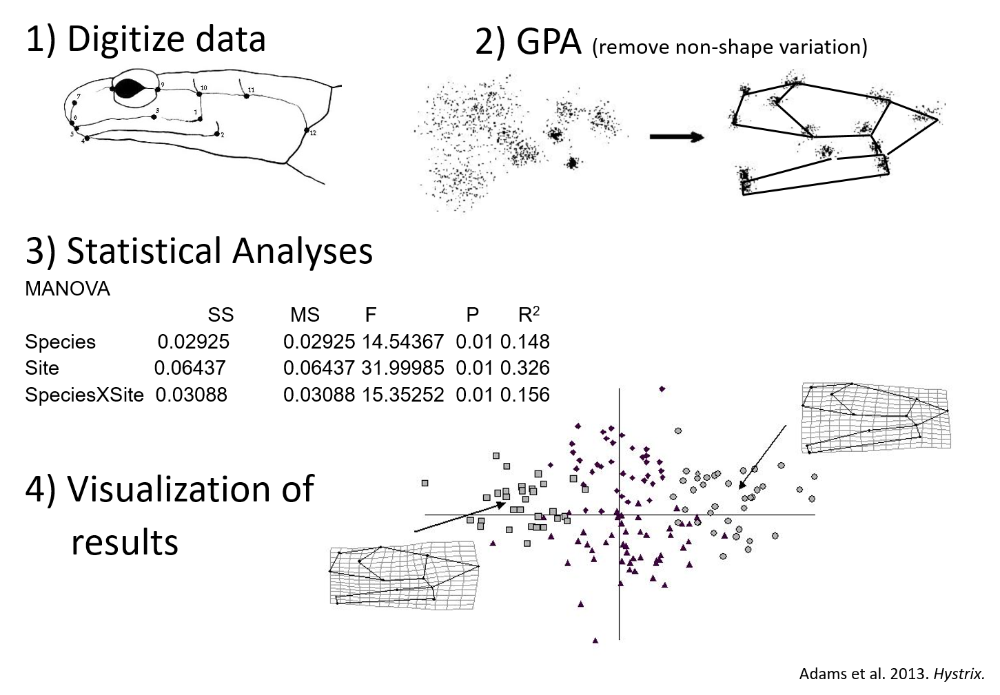{width="100%" style="max-height: 65vh; object-fit: contain;"}
:::
:::

---

## Superposición de Procrustes

::: {.columns}
::: {.column width="60%"}
### Estandarización de la forma
::: incremental
- Antes de realizar análisis estadísticos, deben eliminarse las diferencias triviales de posición, escala y orientación.
- La **superposición de Procrustes** (GPA) remueve los efectos del tamaño absoluto, la rotación y la traslación de los modelos tridimensionales, permitiendo que solo las "formas" (*shape*) sean estrictamente comparables.
:::
:::
::: {.column width="40%"}
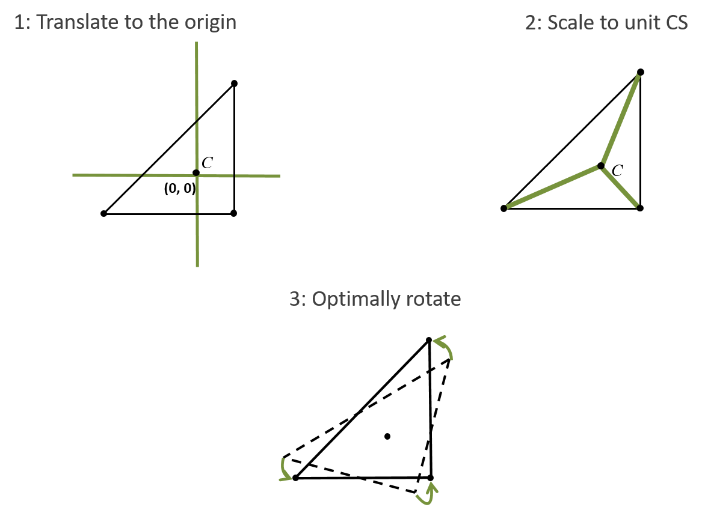{width="100%" style="max-height: 65vh; object-fit: contain;"}
:::
:::

---

## Análisis Multivariado del Morfoespacio

::: {.columns}
::: {.column width="60%"}
### PCA y visualización morfológica
::: incremental
- Tras la superposición, las coordenadas 3D estandarizadas se analizan matemáticamente.
- **PCA (Análisis de Componentes Principales):** Agrupa la varianza para cuantificar y explorar los principales ejes de variación morfológica entre los especímenes.
- Visualización: Espacios morfológicos (*morphospaces*) donde cada punto es una forma.
:::
:::
::: {.column width="40%"}
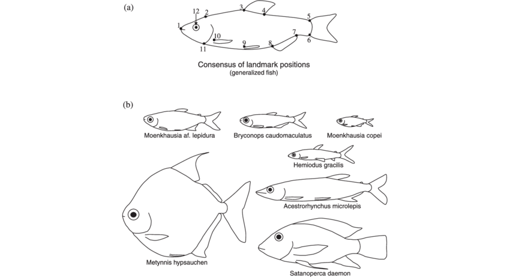{width="100%" style="max-height: 65vh; object-fit: contain;"}
:::
:::

---

## Thin-Plate Splines (TPS)

::: {.columns}
::: {.column width="60%"}
### Interpolación espacial entre formas
::: incremental
- La morfometría geométrica se combina frecuentemente con simulaciones biomecánicas (como el FEA) utilizando algoritmos de interpolación espacial.
- **Warping / Deformación:** Permite doblar el espacio (y las mallas) de una configuración de landmarks de referencia hacia otra.
:::
:::
::: {.column width="40%"}
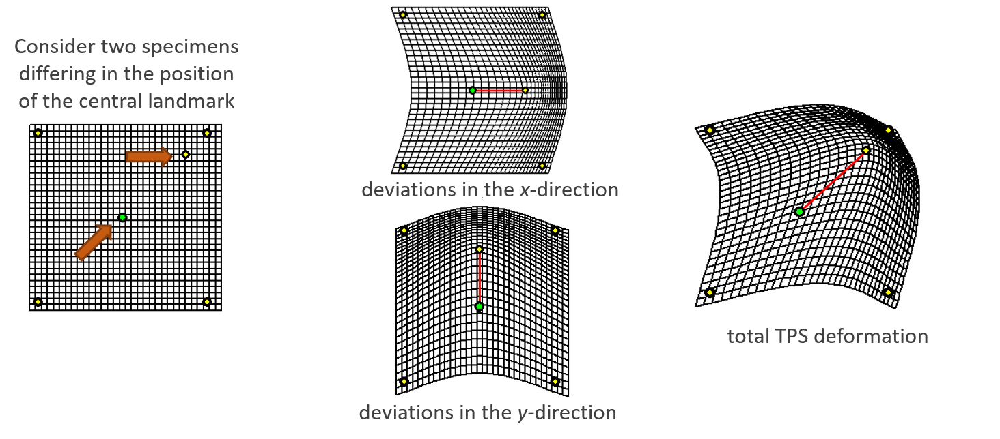{width="100%" style="max-height: 65vh; object-fit: contain;"}
:::
:::

---

## Aplicación Práctica del Warping

::: {.columns}
::: {.column width="60%"}
### Deformación de mallas 3D
::: incremental
- Esta integración permite deformar (*warp*) la malla 3D de un cráneo o hueso conocido hacia morfologías hipotéticas.
- Útil para testear promedios genéricos, intermediarios evolutivos, o reconstruir especímenes fósiles (retrodeformación automatizada) para poner a prueba hipótesis de convergencia funcional.
:::
:::
::: {.column width="40%"}
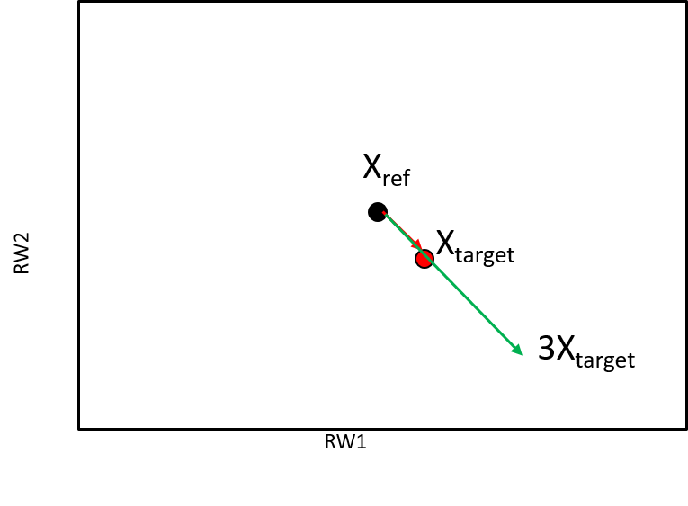{width="100%" style="max-height: 65vh; object-fit: contain;"}
:::
:::

---

## Covariación de la Forma

::: {.columns}
::: {.column width="60%"}
### Regresión multivariada y PLS
::: incremental
- El análisis estadístico frecuentemente se implementa usando regresiones multivariadas o PLS (*Partial Least Squares*).
- **Asociación de variables:** Permite usar la morfología multivariada como variable dependiente o independiente frente a otros datos, probando cómo se asocia estadísticamente con atributos de rendimiento (ej., **fuerza de mordida** o **velocidad**).
:::
:::
::: {.column width="40%"}
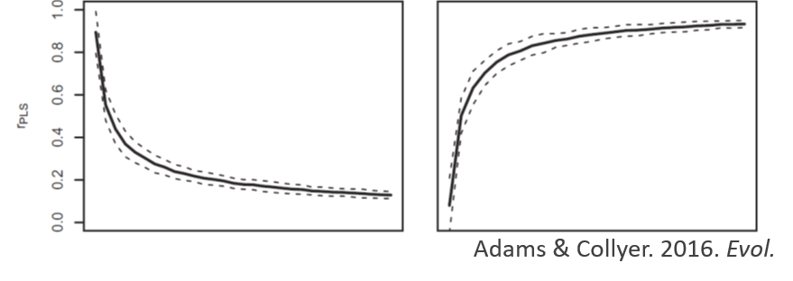{width="100%" style="max-height: 65vh; object-fit: contain;"}
:::
:::

---

## Alometría y Ecomorfología

::: {.columns}
::: {.column width="60%"}
### Forma, tamaño y función
::: incremental
- **Alometría Evolutiva:** Un excelente ejemplo de covariación es modelar si el tamaño anatómico o la fuerza bruta dicta predeciblemente reglas sobre la geometría funcional de las palancas en el cráneo.
- Esto conecta la *GMM* directamente con ecofisiología y biomecánica evolutiva, probando por qué los cráneos tienen la forma que tienen según su función.
:::
:::
::: {.column width="40%"}
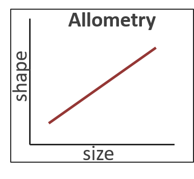{width="100%" style="max-height: 65vh; object-fit: contain;"}
:::
:::

---

## Paisaje Funcional

::: {.columns}
::: {.column width="60%"}
### Topografía de rendimiento biomecánico
::: incremental
- Derivado del "Paisaje Adaptativo" evolutivo, un **paisaje funcional** grafica métricas de rendimiento biomecánico (ej. ventaja mecánica, energía de deformación) en un tercer eje frente a coordenadas morfológicas (Tseng, 2013).
- Modela un panorama de todas las morfologías teóricas posibles, originando una topografía de "picos" (óptimos biomecánicos) y "valles" (formas de bajo rendimiento).
:::
:::
::: {.column width="40%"}
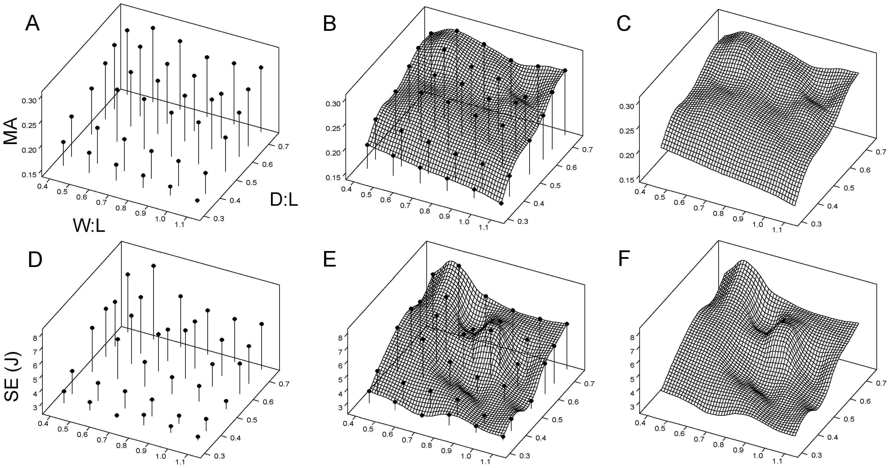{width="100%" style="max-height: 65vh; object-fit: contain;"}
:::
:::

---

## Convergencia Evolutiva

::: {.columns}
::: {.column width="60%"}
### Trayectorias macroevolutivas
::: incremental
- Superponiendo trayectorias macroevolutivas reales de cráneos fósiles y actuales (ej. hienas, cánidos trituradores de hueso), se comprueba si la morfología **evolucionó direccionalmente para escalar los picos óptimos de su nicho**.
- Permite detectar casos donde la convergencia morfológica responde directamente a requerimientos mecánicos restrictivos para sobrevivir.
:::
:::
::: {.column width="40%"}
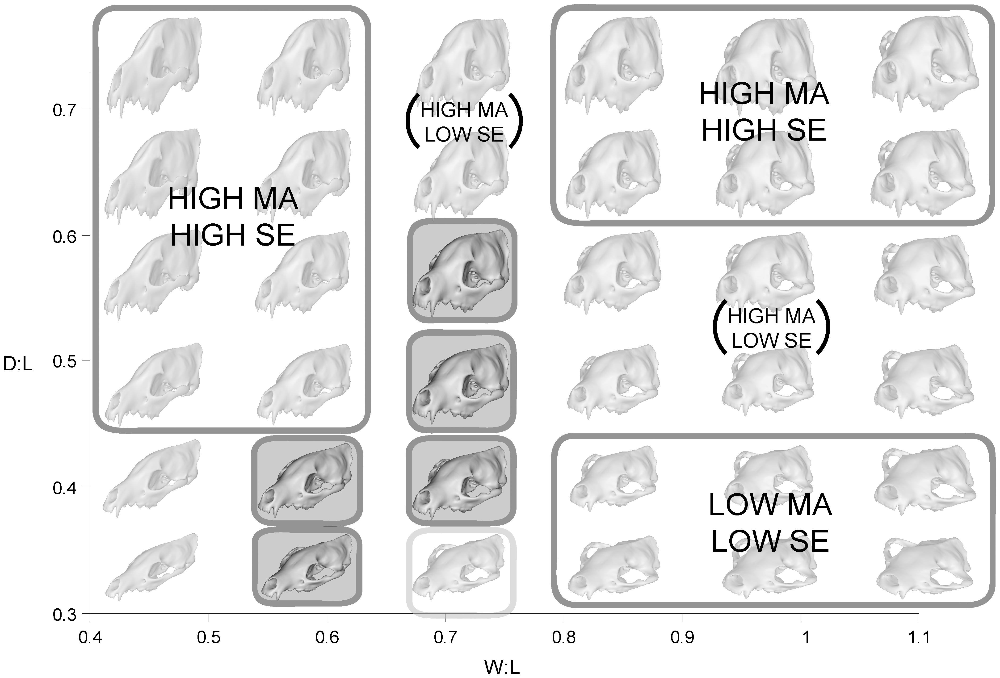{width="100%" style="max-height: 65vh; object-fit: contain;"}
:::
:::

---

# Práctica en R: GMM con Carnívora {background-color="#1E2B3A"}

```{r}
#| include: false
library(ggplot2)
set.seed(42)

familia   <- factor(rep(c("Canidae","Felidae","Ursidae","Hyaenidae"), each = 8),
                    levels = c("Canidae","Felidae","Ursidae","Hyaenidae"))
mordida_N <- c(rnorm(8, 600, 80), rnorm(8, 950, 100),
               rnorm(8, 1300, 150), rnorm(8, 2100, 200))

# Coordenadas de Procrustes simuladas (20 lm × 3 coords → matriz n × 60)
shape <- matrix(rnorm(32 * 60, 0, 0.15), 32, 60)
offsets <- c(-2.0, 0.0, 0.6, 1.8)  # separación PC1 por familia
for (i in seq_along(levels(familia))) {
  idx <- familia == levels(familia)[i]
  shape[idx, 1] <- shape[idx, 1] + offsets[i]
  shape[idx, 2] <- shape[idx, 2] + rnorm(1, 0, 0.4)
}

pca    <- prcomp(shape, scale. = FALSE)
pc_var <- summary(pca)$importance[2, ] * 100

df_pca <- data.frame(
  PC1     = pca$x[, 1], PC2 = pca$x[, 2],
  familia = familia,     mordida_N = mordida_N
)

# PLS base R: SVD de la matriz de covarianza cruzada
X       <- scale(shape)
Y       <- as.matrix(scale(log(mordida_N)))
svd_res <- svd(t(X) %*% Y, nu = 1, nv = 1)
df_pls  <- data.frame(
  PLS_forma   = as.vector(X %*% svd_res$u[, 1]),
  log_mordida = as.vector(log(mordida_N)),
  familia     = familia
)
```

## La Base de Datos — Array de Landmarks 3D {.smaller}

```{r}
#| echo: true
#| eval: true
#| output-location: column
#| code-line-numbers: "|4-12|14-15"
set.seed(42)

# p landmarks × k coordenadas × n especímenes
craneos_3d <- array(
  data = rnorm(20 * 3 * 30),
  dim  = c(20, 3, 30),
  dimnames = list(
    paste0("lm_", sprintf("%02d", 1:20)),  # 20 landmarks
    c("x", "y", "z"),                      # 3 coordenadas 3D
    paste0("sp_", 1:30)                    # 30 especímenes
  )
)

dim(craneos_3d)        # p × k × n
craneos_3d[1:4, , 1]  # 4 landmarks del espécimen 1
```

---

## Paso 1 — Superposición de Procrustes (GPA) {.smaller}

::: {.columns}
::: {.column width="60%"}
```{r}
#| echo: true
#| eval: false
#| code-line-numbers: "|1|3-4|6-8"
library(geomorph)

# GPA: elimina posición, escala y orientación
gpa <- gpagen(craneos_3d, print.progress = FALSE)

# Resultados
gpa$coords  # coordenadas de Procrustes  (p × k × n)
gpa$Csize   # tamaño del centroide por espécimen  (n)
```
:::
::: {.column width="40%"}
::: incremental
- `gpagen()` aplica la **superposición generalizada de Procrustes** en un paso.
- `$coords` — forma pura: sin escala, rotación ni traslación.
- `$Csize` — proxy del tamaño corporal; útil como covariable en análisis de alometría.
:::
:::
:::

---

## Paso 2 — PCA y Morfoespacio {.smaller}

::: {.columns}
::: {.column width="55%"}
```{r}
#| echo: true
#| eval: false
#| code-line-numbers: "|1-2|4-5|7-12"
# PCA sobre coordenadas de Procrustes
pca <- gm.prcomp(gpa$coords)

# Varianza explicada por cada componente
summary(pca)

# Morfoespacio (cada punto = un espécimen)
plot(pca,
     main = "Morfoespacio — Carnívora",
     pch  = 19,
     col  = as.factor(familia))
legend("topright", legend = levels(familia),
       pch = 19, col = 1:nlevels(familia))
```
:::
::: {.column width="45%"}
```{r}
#| echo: false
#| eval: true
#| fig-height: 5
ggplot(df_pca, aes(PC1, PC2, color = familia)) +
  geom_point(size = 4, alpha = 0.85) +
  stat_ellipse(level = 0.75, linewidth = 0.5) +
  labs(
    title  = "Morfoespacio — Carnívora",
    x      = sprintf("PC1 (%.1f%%)", pc_var[1]),
    y      = sprintf("PC2 (%.1f%%)", pc_var[2]),
    color  = "Familia"
  ) +
  scale_color_brewer(palette = "Set1") +
  theme_minimal(base_size = 14)
```
:::
:::

---

## Paso 3 — PLS: Forma vs. Fuerza de Mordida {.smaller}

::: {.columns}
::: {.column width="55%"}
```{r}
#| echo: true
#| eval: false
#| code-line-numbers: "|1-2|4-9|11-14"
# Vector de fuerza de mordida (un valor por espécimen, en N)
mordida_N <- c(...)

# PLS de dos bloques: ¿covaria la forma con la fuerza?
pls <- two.b.pls(
  A1 = two.d.array(gpa$coords),  # bloque 1: forma (matriz 2D)
  A2 = log(mordida_N),            # bloque 2: log-mordida
  print.progress = FALSE
)

summary(pls)   # r-PLS y p-valor permutacional
plot(pls,
     main  = "Covariación forma–mordida en Carnívora",
     label = rownames(mordida_N))
```
:::
::: {.column width="45%"}
```{r}
#| echo: false
#| eval: true
#| fig-height: 5
ggplot(df_pls, aes(PLS_forma, log_mordida, color = familia)) +
  geom_point(size = 4, alpha = 0.85) +
  geom_smooth(method = "lm", se = TRUE,
              color = "gray40", linetype = "dashed") +
  labs(
    title = "Covariación Forma–Mordida (PLS)",
    x     = "Puntaje PLS — Forma (Bloque 1)",
    y     = "log(Fuerza de Mordida) [N]",
    color = "Familia"
  ) +
  scale_color_brewer(palette = "Set1") +
  theme_minimal(base_size = 14)
```
:::
:::

---

# Estimación de Máxima apertura mandibular y fuerza de mordida {background-color="#1E2B3A"}

## Introducción a la Estimación de apertura mandibular

::: {.columns}
::: {.column width="60%"}
### Modelando la función mandibular
::: incremental
- El rendimiento de la mordida, la cinemática de las mandíbulas y la tensión mecánica en animales extintos se analizan mediante simulaciones computacionales como el Análisis de Dinámica Multicuerpo (MDA) o FEA.
- **Reconstrucción previa:** Para estas estimaciones, es indispensable reconstruir la musculatura craneal (ej. los músculos aductores).

:::
:::
::: {.column width="40%"}
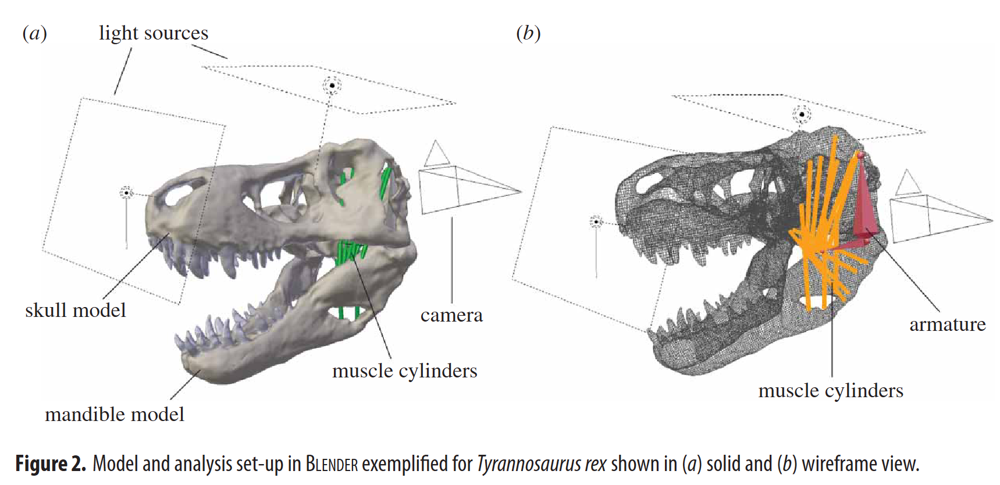{width="100%" style="max-height: 65vh; object-fit: contain;"}
:::
:::

---

## Cálculo del PCSA

::: {.columns}
::: {.column width="60%"}
### Área de Sección Transversal Fisiológica
::: incremental
- La fuerza máxima (contracción isométrica) que puede generar un músculo fisiológico se calcula a partir de su **Área de Sección Transversal Fisiológica (PCSA)**.
- **Fórmula:** PCSA se obtiene estimando el volumen tridimensional del músculo y dividiéndolo por la longitud de sus fibras multiplicada por el coseno de su ángulo de penación.
- Los cálculos pueden ser realizados mediante software especializado como MyoGeneratorRemix.
:::
:::
::: {.column width="40%"}
{width="100%" style="max-height: 65vh; object-fit: contain;"}
:::
:::

---

## Metodología de Lautenschlager (Gape)

::: {.columns}
::: {.column width="60%"}
### Estimación de Apertura Mandibular
::: incremental
- La metodología de **Stephan Lautenschlager** se centra en calcular la **apertura mandibular máxima** (*gape*) a través de los límites de deformación muscular.
- **Modelado de cilindros:** Utilizando modelos 3D en Blender, los músculos aductores se modelan como primitivas (cilindros) anclados entre orígenes e inserciones.
- Midiendo el estiramiento (*strain*) relativo conforme la mandíbula se abre, determina el límite de tensión óptimo y máximo fisiológico antes del desgarro (ej. 130%-170%).
:::
:::
::: {.column width="40%"}
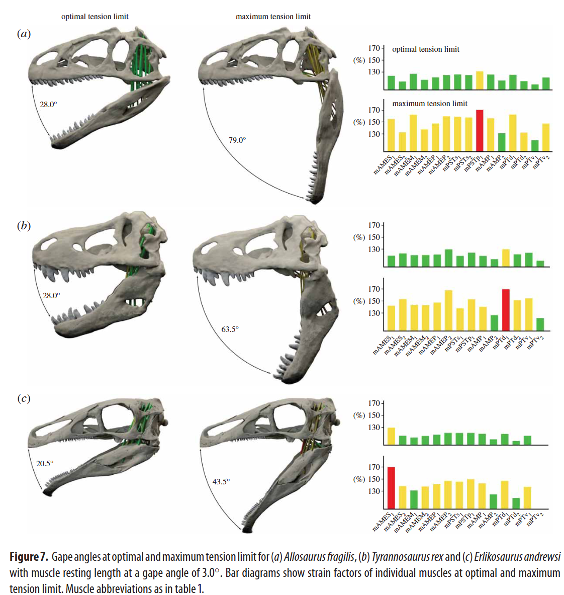{width="100%" style="max-height: 65vh; object-fit: contain;"}
:::
:::

---

## Implementación MUFIS en Blender

::: {.columns}
::: {.column width="60%"}
### Integración Dual Biomecánica
::: incremental
- Inicialmente los flujos 3D eran puramente visuales o requerían scripting manual. De ahí surge [MUFIS (*Muscle Fiber Simulator*)](https://migueldlm.github.io/MUFIS/).
- **Unifica dos métodos fundamentales:**
  - El método de **Lautenschlager (2015)** para evaluar y simular el factor de estiramiento y apertura mandibular máxima en la cinemática.
  - El método de **Hartstone-Rose et al. (2012)** para estimar la **fuerza de mordida** real basada en el área seccional (PCSA) y los brazos de momento funcional.
- Calcula paramétricamente la fuerza isotrópica generada por cada cilindro muscular activo.
:::
:::
::: {.column width="40%"}
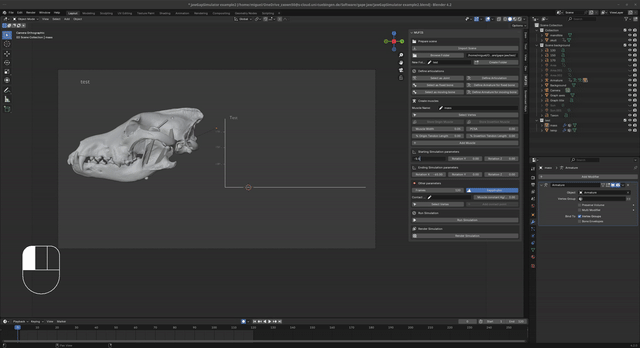{width="100%" style="max-height: 65vh; object-fit: contain;"}
:::
:::

---

## Bibliografía

::: {#refs}
:::
