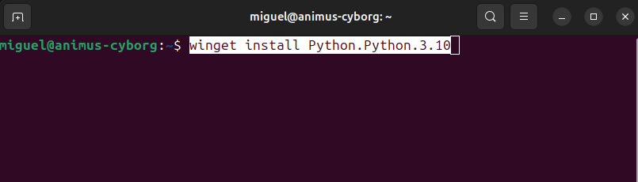
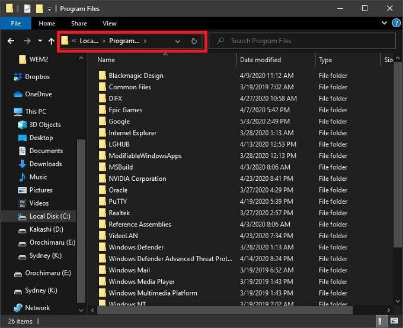
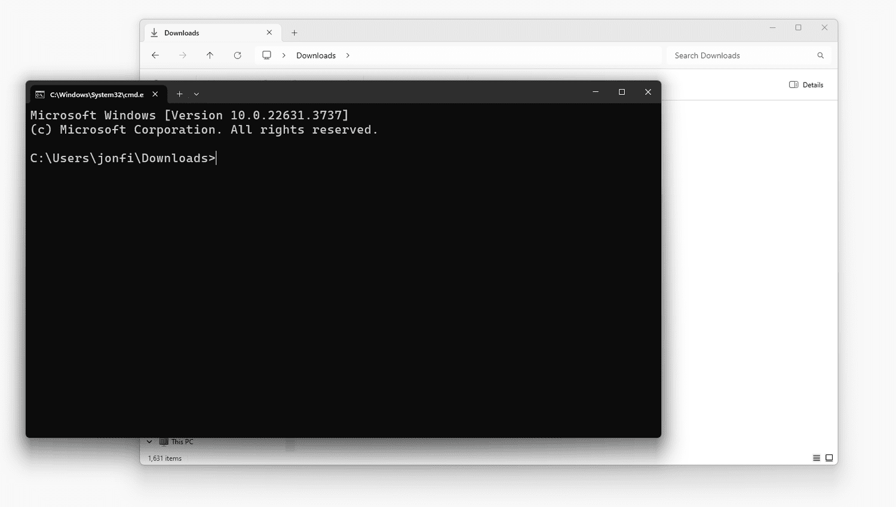

# convert_mesh.py — Conversor de mallas 3D

Convierte archivos de malla entre los formatos más usados en paleontología:
**STL, OBJ, PLY, VTK** y una docena más.

Motor principal: [trimesh](https://trimsh.org) + [meshio](https://github.com/nschloe/meshio).
Si trimesh falla (común con PLY multi-textura), el script intenta meshio automáticamente.

## Estructura de archivos

```text
scripts/
├── convert_mesh.py       # Conversor de modelos 3D (STL, OBJ, PLY, VTK)
├── README.md             # Guía de uso y configuración
└── venv/                 # Entorno virtual de Python (creado localmente)
├── malla_1.stl # Ejemplo de archivo de entrada
├── malla_2.obj # Ejemplo de archivo de entrada
├── malla_3.ply # Ejemplo de archivo de entrada
└── malla_4.vtk # Ejemplo de archivo de entrada
```

---

## Instalación rápida

### 0. Instala python

Puedes descargar python desde [python.org](https://www.python.org/downloads/) o ejecutar uno de los siguientes comandos en una terminal (consola). En windows puedes usar el buscador de windows para encontrar "consola" o "powershell".



```bash
# Linux / macOS
sudo apt install python3

# Windows (PowerShell)
winget install Python.Python.3.10
```


### 1. Crear el entorno virtual

Dirígete a la carpeta donde se encuentra el script y donde colocarás los archivos que quieras convertir y abre una terminal. 


Haz click en la barra de direcciones de windows y escribe "cmd" y presiona enter.

La terminal que se abrirá deberá mostrar exactamente la ruta en la que estás. Asegúrate de que la ruta corresponda a la carpeta donde se encuentra el script y donde colocarás los archivos que quieras convertir.



Ahora procederemos a crear un entorno virtual para python. Un entorno virtual aísla las librerías de este proyecto del resto del sistema.
Esto evita conflictos de versiones con otros proyectos de Python.

```bash
# Dentro de la carpeta scripts/
python3 -m venv mi_entorno
```

Se crea una carpeta `mi_entorno/` con su propio Python y pip.
**Solo necesitas hacer esto una vez, pero dicho entorno sólo funcionará si está activo**

### 2. Activar el entorno

```bash
# Linux / macOS
source mi_entorno/bin/activate

# Windows (PowerShell)
mi_entorno\Scripts\Activate.ps1

# Windows (cmd)
mi_entorno\Scripts\activate.bat
```

El prompt cambia a `(venv) $` para indicar que está activo.

### 3. Instalar dependencias

```bash
pip install meshio trimesh
```

`meshio` maneja formatos científicos (VTK, MSH, XDMF).
`trimesh` es más robusto con mallas de superficie y preserva color.

---

## Uso

### Convertir un archivo

```bash
python convert_mesh.py fosil.ply -f obj # Convierte el archivo fosil.ply a obj
python convert_mesh.py escaneo.stl -f ply # Convierte el archivo escaneo.stl a ply
python convert_mesh.py modelo.obj -f vtk # Convierte el archivo modelo.obj a vtk
```

El archivo de salida se guarda en el mismo directorio con la nueva extensión.

### Convertir varios archivos a la vez

```bash
# Todos los PLY del directorio actual
python convert_mesh.py *.ply -f stl

# Archivos específicos
python convert_mesh.py scan1.ply scan2.ply scan3.ply -f obj
```

### Ver formatos disponibles

```bash
python convert_mesh.py --list-formats
```

Salida de ejemplo:
```
stl    Stereolithography — universal, ideal para impresión 3D
obj    Wavefront OBJ — con textura y materiales (.mtl)
ply    Polygon File Format — color por vértice, datos científicos
vtk    VTK Legacy — mallas volumétricas y datos FEA/CFD
...
```

### Ayuda

```bash
python convert_mesh.py --help
```

---

## Cuándo usar cada formato

| Formato | Úsalo cuando… |
|---------|---------------|
| **STL** | Vas a imprimir en 3D o necesitas máxima compatibilidad |
| **OBJ** | Necesitas color/textura o vas a subir a Sketchfab/MorphoSource |
| **PLY** | El escáner exporta PLY con color por vértice |
| **VTK** | Haces FEA o CFD y necesitas datos por celda |

---

## ¿Por qué un entorno virtual?

Sin `venv`, `pip install meshio` instala en el Python global del sistema.
Esto puede:

- Romper otras aplicaciones que usen una versión diferente de la misma librería.
- Crear conflictos al actualizar paquetes del sistema operativo.
- Hacer imposible reproducir el entorno exacto en otra máquina.

Con `venv`, cada proyecto tiene su propio Python aislado.
El entorno se puede borrar y recrear en minutos con los mismos tres pasos de arriba.

---

## Notas

- El archivo de salida se escribe en el mismo directorio que el original.
- Si el archivo de salida ya existe, se sobreescribe sin aviso.
- trimesh se intenta primero porque es más robusto con PLY que incluyen color o multi-textura.
- Si ambas librerías fallan, el error de cada una se imprime para diagnóstico.
